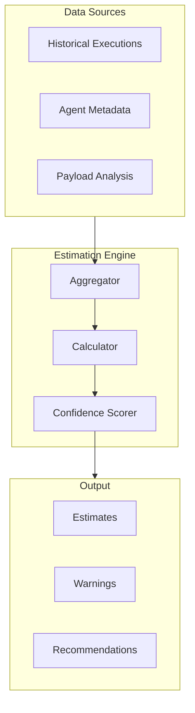

# Cost Estimation

IntentusNet supports pre-execution cost estimation to help with capacity planning, budget management, and execution decisions.

## Estimation Model

Cost estimation uses multiple data sources:



## What Can Be Estimated

### Time Estimates

```python
@dataclass
class TimeEstimate:
    min_ms: float          # Best case
    max_ms: float          # Worst case
    typical_ms: float      # P50 or median
    p95_ms: float          # 95th percentile
    confidence: str        # high/medium/low
```

**Based on:**
- Historical execution latencies
- Agent-declared processing time
- Payload size heuristics

### Resource Estimates

```python
@dataclass
class ResourceEstimate:
    memory_mb: int         # Expected memory usage
    cpu_units: float       # CPU fraction (1.0 = 1 core)
    network_kb: int        # Network transfer estimate
```

**Based on:**
- Agent resource declarations
- Payload size
- Historical resource usage

### Cost Estimates

```python
@dataclass
class CostEstimate:
    currency: str          # "USD"
    min: float             # Minimum cost
    max: float             # Maximum cost
    typical: float         # Expected cost
```

**Based on:**
- Agent-declared cost per execution
- Historical cost data
- External API pricing (if configured)

## Estimation Sources

### Historical Data

```python
class HistoricalEstimator:
    def estimate(self, intent: str, payload_size: int) -> Estimate:
        # Find similar past executions
        similar = self.find_similar(intent, payload_size)

        if len(similar) >= 100:
            confidence = "high"
        elif len(similar) >= 10:
            confidence = "medium"
        else:
            confidence = "low"

        return Estimate(
            time=self._compute_time_stats(similar),
            cost=self._compute_cost_stats(similar),
            confidence=confidence,
            sample_size=len(similar)
        )
```

### Agent Metadata

Agents can declare their estimates:

```python
AgentDefinition(
    name="processor-a",
    capabilities=[...],
    # Estimation metadata
    estimates=AgentEstimates(
        time_ms={"min": 100, "typical": 200, "max": 1000},
        cost_per_execution=0.002,
        memory_mb=256,
        cpu_units=0.5
    )
)
```

### Payload Heuristics

Estimate based on payload characteristics:

```python
def estimate_from_payload(payload: dict) -> PayloadEstimate:
    size_bytes = len(json.dumps(payload).encode())

    # Heuristics
    if size_bytes < 1024:
        time_factor = 1.0
    elif size_bytes < 10240:
        time_factor = 1.5
    elif size_bytes < 102400:
        time_factor = 3.0
    else:
        time_factor = 5.0

    return PayloadEstimate(
        size_bytes=size_bytes,
        time_factor=time_factor,
        warnings=["Large payload may increase latency"] if size_bytes > 102400 else []
    )
```

## Estimation API

### Basic Usage

```python
from intentusnet import IntentusRuntime, EstimationEngine

runtime = IntentusRuntime()
estimator = EstimationEngine(runtime)

estimate = estimator.estimate(
    intent="ProcessIntent",
    payload={"document": "large text..."},
    strategy=RoutingStrategy.DIRECT
)

print(f"Time: {estimate.time.typical_ms}ms")
print(f"Cost: ${estimate.cost.typical}")
print(f"Confidence: {estimate.confidence}")
```

### With Budget Check

```python
estimate = estimator.estimate_with_budget(
    intent="ExpensiveIntent",
    payload=payload,
    budget_limit=10.0  # $10 max
)

if not estimate.within_budget:
    print(f"Over budget by ${estimate.overage}")
    if estimate.alternatives:
        print(f"Cheaper alternative: {estimate.alternatives[0]}")
```

### Fallback Estimates

```python
estimate = estimator.estimate(
    intent="ProcessIntent",
    payload=payload,
    strategy=RoutingStrategy.FALLBACK,
    include_fallbacks=True
)

# Worst case: all agents fail until last
print(f"Worst case time: {estimate.worst_case.time_ms}ms")
print(f"Worst case cost: ${estimate.worst_case.cost}")
```

## Configuring Estimation

### Enable Cost Tracking

```python
runtime = IntentusRuntime(
    enable_recording=True,
    enable_cost_tracking=True,
    cost_config=CostConfig(
        default_currency="USD",
        track_external_apis=True
    )
)
```

### External API Costs

Configure known API costs:

```python
cost_config = CostConfig(
    external_apis={
        "openai-gpt4": {
            "input_per_1k_tokens": 0.03,
            "output_per_1k_tokens": 0.06
        },
        "anthropic-claude": {
            "input_per_1k_tokens": 0.008,
            "output_per_1k_tokens": 0.024
        }
    }
)
```

### Agent Cost Declaration

```python
class ExpensiveAgent(BaseAgent):
    COST_PER_EXECUTION = 0.05  # $0.05 per execution

    def handle_intent(self, env: IntentEnvelope) -> AgentResponse:
        # Track actual cost
        actual_cost = self.call_expensive_api(env.payload)

        response = AgentResponse.success(
            result,
            agent=self.name,
            extra_metadata={"actual_cost": actual_cost}
        )
        return response
```

## Accuracy Considerations

### What Affects Accuracy

| Factor | Impact |
|--------|--------|
| Historical data volume | More data = higher accuracy |
| Payload variance | Similar payloads = better estimates |
| Agent stability | Stable agents = predictable costs |
| External API pricing | May change without notice |

### Confidence Levels

| Level | Sample Size | Accuracy |
|-------|-------------|----------|
| High | 100+ | ±20% |
| Medium | 10-100 | ±50% |
| Low | Less than 10 | ±100% |
| Unknown | 0 | Default values |

### Improving Accuracy

1. **Enable recording** for all executions
2. **Declare agent estimates** in metadata
3. **Track actual costs** in response metadata
4. **Calibrate regularly** against actuals

## Use Cases

### Budget Gates

```python
def execute_with_budget_gate(intent, payload, max_cost):
    estimate = estimator.estimate(intent, payload)

    if estimate.cost.typical > max_cost:
        raise BudgetExceededError(
            f"Estimated ${estimate.cost.typical} exceeds ${max_cost}"
        )

    return runtime.execute(intent, payload)
```

### Capacity Planning

```python
# Estimate batch job requirements
jobs = load_batch_jobs()

total_time = 0
total_cost = 0
peak_memory = 0

for job in jobs:
    est = estimator.estimate(job.intent, job.payload)
    total_time += est.time.typical_ms
    total_cost += est.cost.typical
    peak_memory = max(peak_memory, est.resources.memory_mb)

print(f"Batch estimates:")
print(f"  Total time: {total_time / 1000 / 60:.1f} minutes")
print(f"  Total cost: ${total_cost:.2f}")
print(f"  Peak memory: {peak_memory} MB")
```

### Cost Optimization

```python
# Compare strategies
direct = estimator.estimate(intent, payload, strategy=RoutingStrategy.DIRECT)
fallback = estimator.estimate(intent, payload, strategy=RoutingStrategy.FALLBACK)

print(f"DIRECT: ${direct.cost.typical} ({direct.time.typical_ms}ms)")
print(f"FALLBACK worst case: ${fallback.worst_case.cost} ({fallback.worst_case.time_ms}ms)")
```

## Limitations

:::warning Estimation Limits
Cost estimation provides guidance, not guarantees. Actual costs may vary due to:
- External API pricing changes
- Network conditions
- Agent performance variance
- Unexpected retries
:::

**Not estimated:**
- Network retry costs
- Infrastructure overhead
- Debugging/support time

## Summary

| Feature | Status |
|---------|--------|
| Time estimation | Available |
| Resource estimation | Available |
| Cost estimation | Available (configure pricing) |
| Historical analysis | With recording enabled |
| Budget gates | Available |
| Accuracy | Depends on data volume |

## See Also

- [`intentusnet estimate`](../cli/estimate) — CLI command
- [Observability](../production/observability) — Cost metrics integration
