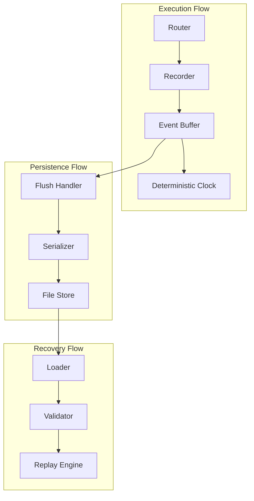
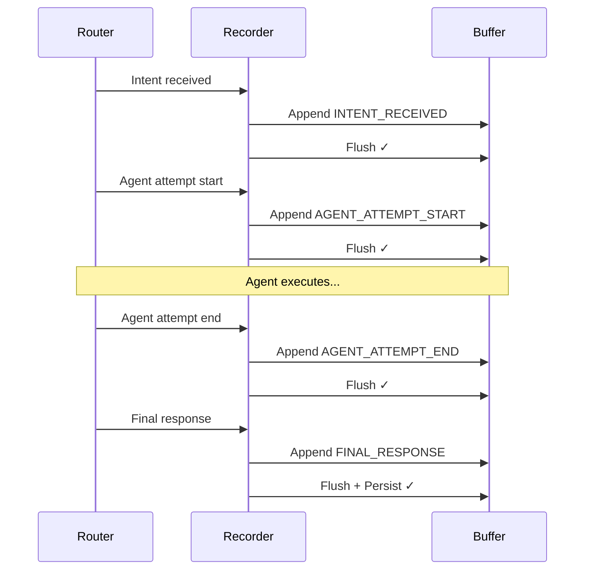

# Crash Safety Internals

This document provides an in-depth look at how IntentusNet implements crash-safe execution through recording, checkpointing, and recovery mechanisms.

## Recording Architecture



## Execution Record Structure

Every execution produces an `ExecutionRecord`:

```python
@dataclass
class ExecutionRecord:
    header: ExecutionHeader
    envelope: Dict[str, Any]
    routerDecision: Optional[Dict[str, Any]]
    events: List[ExecutionEvent]
    finalResponse: Optional[Dict[str, Any]]
```

### Header Details

```python
@dataclass
class ExecutionHeader:
    executionId: str           # Format: "exec-{16-hex-chars}"
    createdUtcIso: str         # ISO 8601 timestamp
    envelopeHash: str          # Format: "sha256:{64-hex-chars}"
    replayable: bool           # Safe to replay
    replayableReason: Optional[str]  # If not replayable, why
```

### Envelope Hash Computation

The hash ensures envelope integrity:

```python
import hashlib
import json

def compute_envelope_hash(envelope: dict) -> str:
    # Canonical JSON: sorted keys, minimal separators
    canonical = json.dumps(
        envelope,
        sort_keys=True,
        separators=(',', ':'),
        ensure_ascii=True
    )
    hash_bytes = hashlib.sha256(canonical.encode('utf-8')).hexdigest()
    return f"sha256:{hash_bytes}"
```

**Canonicalization rules:**
- Keys sorted alphabetically at all levels
- No whitespace (separators=`(',', ':')`)
- ASCII encoding (Unicode escaped)
- Deterministic float formatting

## Event Recording

### Deterministic Clock

Events use sequence numbers, not wall-clock time:

```python
class DeterministicClock:
    def __init__(self):
        self._seq = 0
        self._lock = threading.Lock()

    def next(self) -> int:
        with self._lock:
            self._seq += 1
            return self._seq

    def current(self) -> int:
        return self._seq
```

**Why sequence numbers?**
- Wall-clock can drift or go backwards
- Sequence provides total ordering
- Deterministic on replay

### Event Types

```python
class EventType(Enum):
    INTENT_RECEIVED = "INTENT_RECEIVED"
    AGENT_ATTEMPT_START = "AGENT_ATTEMPT_START"
    AGENT_ATTEMPT_END = "AGENT_ATTEMPT_END"
    FALLBACK_TRIGGERED = "FALLBACK_TRIGGERED"
    ROUTER_DECISION = "ROUTER_DECISION"
    FINAL_RESPONSE = "FINAL_RESPONSE"
```

### Event Structure

```python
@dataclass
class ExecutionEvent:
    seq: int                   # Sequence number from clock
    type: EventType            # Event type
    payload: Dict[str, Any]    # Event-specific data
    timestamp: Optional[str]   # Wall-clock for debugging (not for ordering)
```

## Flush Boundaries

Events are flushed to the recorder at specific boundaries:



**Flush semantics:**
- Each event type triggers immediate flush to buffer
- `FINAL_RESPONSE` triggers persist to storage
- Crash between flushes loses at most one event

## In-Memory Recorder

```python
class InMemoryExecutionRecorder:
    def __init__(self, clock: DeterministicClock):
        self._clock = clock
        self._events: List[ExecutionEvent] = []
        self._header: Optional[ExecutionHeader] = None
        self._envelope: Optional[dict] = None
        self._finalized = False

    def start(self, envelope: dict) -> str:
        """Start recording, return execution ID."""
        execution_id = generate_execution_id()
        self._header = ExecutionHeader(
            executionId=execution_id,
            createdUtcIso=datetime.utcnow().isoformat() + "Z",
            envelopeHash=compute_envelope_hash(envelope),
            replayable=True,
            replayableReason=None
        )
        self._envelope = envelope
        return execution_id

    def record_event(self, event_type: EventType, payload: dict) -> None:
        """Record an event with next sequence number."""
        if self._finalized:
            raise RecorderError("Cannot record after finalization")

        event = ExecutionEvent(
            seq=self._clock.next(),
            type=event_type,
            payload=payload,
            timestamp=datetime.utcnow().isoformat() + "Z"
        )
        self._events.append(event)

    def finalize(self, final_response: dict) -> ExecutionRecord:
        """Finalize and return the complete record."""
        self._finalized = True
        return ExecutionRecord(
            header=self._header,
            envelope=self._envelope,
            routerDecision=self._extract_router_decision(),
            events=self._events,
            finalResponse=final_response
        )

    def mark_not_replayable(self, reason: str) -> None:
        """Mark record as not replayable."""
        if self._header:
            self._header.replayable = False
            self._header.replayableReason = reason
```

## File-Based Persistence

### FileExecutionStore

```python
class FileExecutionStore:
    def __init__(self, base_path: str = ".intentusnet/records"):
        self._base_path = Path(base_path)
        self._base_path.mkdir(parents=True, exist_ok=True)

    def save(self, record: ExecutionRecord) -> str:
        """Save record atomically."""
        path = self._base_path / f"{record.header.executionId}.json"
        temp_path = path.with_suffix('.tmp')

        # Write to temp file
        with open(temp_path, 'w') as f:
            json.dump(record.to_dict(), f, indent=2)

        # Atomic rename (POSIX guarantee)
        temp_path.rename(path)

        return str(path)

    def load(self, execution_id: str) -> ExecutionRecord:
        """Load record by ID."""
        path = self._base_path / f"{execution_id}.json"
        if not path.exists():
            raise RecordNotFoundError(execution_id)

        with open(path, 'r') as f:
            data = json.load(f)

        return ExecutionRecord.from_dict(data)

    def list_all(self) -> Iterator[str]:
        """List all execution IDs."""
        for path in self._base_path.glob("exec-*.json"):
            yield path.stem
```

### Atomic Write Pattern

```python
def atomic_write(path: Path, data: bytes) -> None:
    """Write data atomically using rename."""
    temp_path = path.with_suffix('.tmp.' + secrets.token_hex(4))

    try:
        # Write to temp file
        with open(temp_path, 'wb') as f:
            f.write(data)
            f.flush()
            os.fsync(f.fileno())  # Force to disk

        # Atomic rename
        temp_path.rename(path)

    finally:
        # Clean up temp file if rename failed
        if temp_path.exists():
            temp_path.unlink()
```

**Why atomic writes?**
- Crash during write doesn't corrupt existing file
- File either fully exists or doesn't exist
- No partial writes visible

## Recovery Process

### Detecting Incomplete Executions

```python
def detect_incomplete(store: FileExecutionStore) -> List[ExecutionRecord]:
    """Find executions that crashed mid-way."""
    incomplete = []
    for exec_id in store.list_all():
        record = store.load(exec_id)
        if not record.header.replayable:
            if record.header.replayableReason == "execution_incomplete":
                incomplete.append(record)
    return incomplete
```

### Analyzing Crash Point

```python
def analyze_crash_point(record: ExecutionRecord) -> dict:
    """Determine where execution crashed."""
    events = record.events

    if not events:
        return {"stage": "before_start", "recovery": "safe_to_retry"}

    last_event = events[-1]

    if last_event.type == EventType.INTENT_RECEIVED:
        return {
            "stage": "after_receive",
            "recovery": "safe_to_retry"
        }

    if last_event.type == EventType.AGENT_ATTEMPT_START:
        return {
            "stage": "during_agent_execution",
            "agent": last_event.payload.get("agent"),
            "recovery": "check_agent_idempotency"
        }

    if last_event.type == EventType.AGENT_ATTEMPT_END:
        status = last_event.payload.get("status")
        if status == "success":
            return {
                "stage": "after_success",
                "recovery": "response_may_be_lost"
            }
        else:
            return {
                "stage": "after_failure",
                "recovery": "retry_next_agent"
            }

    return {"stage": "unknown", "recovery": "manual_inspection"}
```

## Design Goal: WAL-Backed Recording

:::note Future Enhancement
The following describes a planned WAL (Write-Ahead Log) based persistence layer for stronger durability guarantees during execution.
:::

### WAL Concept


**WAL benefits:**
- Events durable before acknowledging
- Recovery from any point in WAL
- Reduced write amplification

### Planned WAL Structure

```
.intentusnet/
├── wal/
│   ├── 00000001.wal
│   ├── 00000002.wal
│   └── current -> 00000002.wal
├── snapshots/
│   └── exec-a1b2c3d4.json
└── checkpoint
```

### WAL Entry Format

```
[length:4][type:1][sequence:8][crc32:4][payload:variable]
```

## Best Practices

### Agent Idempotency

Design agents to handle replay safely:

```python
class IdempotentAgent(BaseAgent):
    def handle_intent(self, env: IntentEnvelope) -> AgentResponse:
        request_id = env.metadata.requestId

        # Check if already processed
        existing = self.cache.get(request_id)
        if existing:
            return existing

        # Process
        result = self.process(env.payload)

        # Cache before returning
        response = AgentResponse.success(result, agent=self.name)
        self.cache.set(request_id, response, ttl=3600)

        return response
```

### Handling Side Effects

Record side effects for recovery:

```python
def process_with_side_effects(self, env: IntentEnvelope) -> AgentResponse:
    request_id = env.metadata.requestId

    # Record intention before side effect
    self.record_intention(request_id, "send_email", env.payload["email"])

    try:
        # Perform side effect
        send_email(env.payload["email"], env.payload["message"])

        # Record completion
        self.record_completion(request_id, "send_email")

    except Exception as e:
        # Side effect may have partially completed
        self.record_failure(request_id, "send_email", str(e))
        raise

    return AgentResponse.success({"sent": True}, agent=self.name)
```

## Summary

| Component | Guarantee |
|-----------|-----------|
| Envelope hash | SHA-256, canonical JSON |
| Sequence numbers | Deterministic ordering |
| Event flush | At each boundary |
| File write | Atomic via rename |
| Recovery | Detect incomplete, analyze crash point |
| WAL | Planned for enhanced durability |

## See Also

- [Crash-Safe Execution](../guarantees/crash-safe-execution) — Guarantee specification
- [Replay Semantics](./replay-semantics) — How replay uses records
