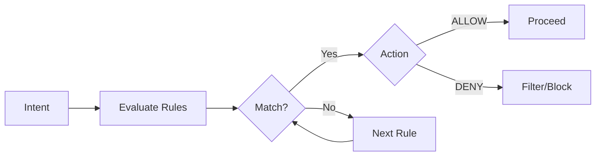

# Policy Design

This guide covers policy design patterns, best practices, and common pitfalls for IntentusNet policy configuration.

## Policy Model

Policies control intent execution through allow/deny rules:



## Rule Structure

```python
@dataclass
class PolicyRule:
    id: str                        # Unique identifier
    action: PolicyAction           # ALLOW or DENY
    intents: List[str]             # Intent patterns
    agents: List[str]              # Agent patterns
    roles: List[str]               # Role patterns
    tenants: List[str]             # Tenant patterns
    payload_regex: Dict[str, str]  # Payload field patterns
    rate_limit_per_minute: Optional[int]
    rate_limit_key_template: Optional[str]
    max_timeout_ms: Optional[int]
    priority: int = 0              # Lower = higher priority
```

## Design Patterns

### 1. Defense in Depth

Layer policies from specific to general:

```python
rules = [
    # Layer 1: Critical system protection
    PolicyRule(
        id="protect-critical",
        action=PolicyAction.DENY,
        intents=["*"],
        agents=["auth-*", "billing-*", "security-*"],
        roles=["*"],
        tenants=["*"],
        priority=0
    ),

    # Layer 2: Admin overrides
    PolicyRule(
        id="admin-override",
        action=PolicyAction.ALLOW,
        intents=["*"],
        agents=["*"],
        roles=["admin"],
        tenants=["*"],
        priority=10
    ),

    # Layer 3: Role-based access
    PolicyRule(
        id="operator-read",
        action=PolicyAction.ALLOW,
        intents=["Get*", "List*", "Search*"],
        agents=["*"],
        roles=["operator"],
        tenants=["*"],
        priority=20
    ),

    # Layer 4: Default deny
    PolicyRule(
        id="default-deny",
        action=PolicyAction.DENY,
        intents=["*"],
        agents=["*"],
        roles=["*"],
        tenants=["*"],
        priority=100
    ),
]
```

### 2. Tenant Isolation

Ensure tenants can only access their resources:

```python
rules = [
    # Tenant A can only use their agents
    PolicyRule(
        id="tenant-a-isolation",
        action=PolicyAction.ALLOW,
        intents=["*"],
        agents=["tenant-a-*"],
        roles=["*"],
        tenants=["tenant-a"],
        priority=10
    ),

    # Tenant B isolation
    PolicyRule(
        id="tenant-b-isolation",
        action=PolicyAction.ALLOW,
        intents=["*"],
        agents=["tenant-b-*"],
        roles=["*"],
        tenants=["tenant-b"],
        priority=10
    ),

    # Block cross-tenant access
    PolicyRule(
        id="block-cross-tenant",
        action=PolicyAction.DENY,
        intents=["*"],
        agents=["tenant-*"],
        roles=["*"],
        tenants=["*"],
        priority=50
    ),
]
```

### 3. Intent Categorization

Group intents by risk level:

```python
# Define intent categories
SAFE_INTENTS = ["Get*", "List*", "Search*", "Count*"]
MUTATING_INTENTS = ["Create*", "Update*", "Modify*"]
DANGEROUS_INTENTS = ["Delete*", "Destroy*", "Purge*", "Drop*"]

rules = [
    # Anyone can read
    PolicyRule(
        id="allow-safe",
        action=PolicyAction.ALLOW,
        intents=SAFE_INTENTS,
        agents=["*"],
        roles=["*"],
        tenants=["*"],
        priority=20
    ),

    # Writers can mutate
    PolicyRule(
        id="allow-mutate",
        action=PolicyAction.ALLOW,
        intents=MUTATING_INTENTS,
        agents=["*"],
        roles=["writer", "admin"],
        tenants=["*"],
        priority=30
    ),

    # Only admins can delete
    PolicyRule(
        id="allow-dangerous",
        action=PolicyAction.ALLOW,
        intents=DANGEROUS_INTENTS,
        agents=["*"],
        roles=["admin"],
        tenants=["*"],
        priority=40
    ),
]
```

### 4. Payload-Based Filtering

Filter based on payload content:

```python
rules = [
    # Block PII in export intents
    PolicyRule(
        id="block-pii-export",
        action=PolicyAction.DENY,
        intents=["Export*"],
        agents=["*"],
        roles=["*"],
        tenants=["*"],
        payload_regex={
            "fields": ".*email.*|.*ssn.*|.*phone.*|.*address.*"
        },
        priority=5
    ),

    # Block large queries
    PolicyRule(
        id="block-large-queries",
        action=PolicyAction.DENY,
        intents=["Query*"],
        agents=["*"],
        roles=["*"],
        tenants=["*"],
        payload_regex={
            "limit": "^[0-9]{4,}$"  # 4+ digits = 1000+
        },
        priority=10
    ),
]
```

### 5. Rate Limiting

Protect against abuse:

```python
rules = [
    # Global rate limit
    PolicyRule(
        id="global-rate-limit",
        action=PolicyAction.ALLOW,
        intents=["*"],
        agents=["*"],
        roles=["*"],
        tenants=["*"],
        rate_limit_per_minute=1000,
        rate_limit_key_template="{source}",
        priority=1
    ),

    # Per-tenant rate limit
    PolicyRule(
        id="tenant-rate-limit",
        action=PolicyAction.ALLOW,
        intents=["*"],
        agents=["*"],
        roles=["*"],
        tenants=["*"],
        rate_limit_per_minute=100,
        rate_limit_key_template="{tenant}",
        priority=5
    ),

    # Expensive intent throttle
    PolicyRule(
        id="expensive-throttle",
        action=PolicyAction.ALLOW,
        intents=["ML*", "Train*", "Generate*"],
        agents=["*"],
        roles=["*"],
        tenants=["*"],
        rate_limit_per_minute=10,
        rate_limit_key_template="{tenant}:{intent}",
        priority=10
    ),
]
```

## Pattern Matching

### Wildcard Patterns

```python
# Match any
"*"                   # Matches everything

# Prefix match
"Process*"            # ProcessIntent, ProcessData, ProcessFile

# Suffix match
"*Intent"             # ProcessIntent, SearchIntent

# Contains (via regex)
"*User*"              # GetUser, UserProfile, CreateUserAccount
```

### Regex in Payloads

```python
payload_regex = {
    # Match email pattern
    "email": r"^[a-zA-Z0-9._%+-]+@[a-zA-Z0-9.-]+\.[a-zA-Z]{2,}$",

    # Match credit card (simplified)
    "card_number": r"^\d{16}$",

    # Match specific values
    "action": r"^(read|write)$",

    # Match JSON paths (if flattened)
    "config.debug": r"^true$"
}
```

## Policy Evaluation

### Evaluation Order

1. Rules sorted by `priority` (ascending)
2. First matching rule wins
3. If no match, default action applies

### Default Actions

```python
PolicyEngine(
    rules=rules,
    default_action=PolicyAction.DENY  # Fail-closed (recommended)
)

# Or
PolicyEngine(
    rules=rules,
    default_action=PolicyAction.ALLOW  # Fail-open (use with caution)
)
```

## Common Pitfalls

### Pitfall 1: Missing Default

```python
# BAD: No default rule
rules = [
    PolicyRule(id="allow-read", action=ALLOW, intents=["Get*"], ...),
    PolicyRule(id="deny-write", action=DENY, intents=["Create*"], ...),
]
# What happens to "SearchIntent"? Undefined!

# GOOD: Always include default
rules = [
    PolicyRule(id="allow-read", action=ALLOW, intents=["Get*"], ...),
    PolicyRule(id="deny-write", action=DENY, intents=["Create*"], ...),
    PolicyRule(id="default", action=DENY, intents=["*"], ..., priority=999),
]
```

### Pitfall 2: Overly Broad Allow

```python
# BAD: This allows everything for everyone
PolicyRule(id="allow-all", action=ALLOW, intents=["*"], roles=["*"], ...)

# GOOD: Be specific
PolicyRule(id="allow-read", action=ALLOW, intents=["Get*"], roles=["reader"], ...)
```

### Pitfall 3: Priority Conflicts

```python
# BAD: Same priority, order undefined
PolicyRule(id="rule-a", priority=10, action=DENY, ...)
PolicyRule(id="rule-b", priority=10, action=ALLOW, ...)

# GOOD: Explicit priorities
PolicyRule(id="rule-a", priority=10, action=DENY, ...)
PolicyRule(id="rule-b", priority=20, action=ALLOW, ...)
```

### Pitfall 4: Blocking vs Filtering

```python
# BAD: Blocks entire intent if ANY target is dangerous
PolicyRule(id="block-cctv", action=DENY, agents=["cctv"], ...)
# Intent targeting [hvac, cctv, lighting] is fully blocked

# GOOD: Filter only the dangerous target
# (This is IntentusNet's default partial filtering behavior)
# The intent proceeds for [hvac, lighting], only cctv is filtered
```

## Testing Policies

### Unit Tests

```python
def test_admin_can_delete():
    engine = PolicyEngine(rules)
    result = engine.evaluate(
        intent="DeleteIntent",
        agent="user-service",
        role="admin",
        tenant="prod"
    )
    assert result.action == PolicyAction.ALLOW

def test_user_cannot_delete():
    engine = PolicyEngine(rules)
    result = engine.evaluate(
        intent="DeleteIntent",
        agent="user-service",
        role="user",
        tenant="prod"
    )
    assert result.action == PolicyAction.DENY
```

### Validation

```bash
intentusnet validate --policy policies.yaml --strict
```

### Dry Run

```bash
intentusnet validate --intent DeleteIntent --targets user-service
```

## Policy Files

### YAML Format

```yaml
# policies.yaml
version: "1.0"
default_action: DENY

rules:
  - id: protect-critical
    action: DENY
    intents: ["*"]
    agents: ["auth-*", "billing-*"]
    roles: ["*"]
    tenants: ["*"]
    priority: 0

  - id: admin-all
    action: ALLOW
    intents: ["*"]
    agents: ["*"]
    roles: ["admin"]
    tenants: ["*"]
    priority: 10

  - id: user-read
    action: ALLOW
    intents: ["Get*", "List*"]
    agents: ["*"]
    roles: ["user", "operator"]
    tenants: ["*"]
    priority: 20
```

### Loading Policies

```python
from intentusnet.security import PolicyEngine, load_policies_from_yaml

policies = load_policies_from_yaml("policies.yaml")
engine = PolicyEngine(policies)
```

## Summary

| Pattern | Use Case |
|---------|----------|
| Defense in Depth | Layered security |
| Tenant Isolation | Multi-tenant systems |
| Intent Categorization | Risk-based access |
| Payload Filtering | Content-based rules |
| Rate Limiting | Abuse prevention |

## See Also

- [Policy Filtering](../guarantees/policy-filtering) — Guarantee specification
- [`intentusnet validate`](../cli/validate) — Policy validation
