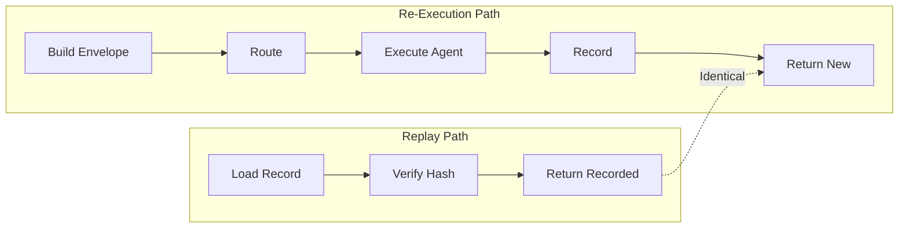

# Replay Semantics

This document provides a detailed specification of IntentusNet's replay behavior, including edge cases and guarantees.

## Core Replay Contract

```
REPLAY CONTRACT:
Given an ExecutionRecord R with status=completed and replayable=true,
replay(R) returns R.finalResponse exactly, with no agent execution.
```

## Replay Engine Implementation

```python
class ReplayEngine:
    def __init__(self, record: ExecutionRecord):
        self._record = record
        self._validated = False

    def is_replayable(self) -> Tuple[bool, Optional[str]]:
        """Check if record is safe to replay."""
        # Must have final response
        if self._record.finalResponse is None:
            return False, "execution_incomplete"

        # Must be marked replayable
        if not self._record.header.replayable:
            return False, self._record.header.replayableReason

        # Must have valid structure
        if not self._validate_structure():
            return False, "record_corrupted"

        return True, None

    def replay(
        self,
        env: Optional[IntentEnvelope] = None,
        force: bool = False
    ) -> ReplayResult:
        """Return recorded response without re-execution."""
        # Check replayability
        ok, reason = self.is_replayable()
        if not ok and not force:
            raise NotReplayableError(reason)

        # Optional envelope verification
        if env is not None:
            self._verify_envelope(env)

        # Return recorded response
        return ReplayResult(
            payload=self._record.finalResponse.get("payload"),
            metadata=self._record.finalResponse.get("metadata", {}),
            fromReplay=True,
            originalExecutionId=self._record.header.executionId,
            originalTimestamp=self._record.header.createdUtcIso
        )

    def _verify_envelope(self, env: IntentEnvelope) -> None:
        """Verify envelope matches recorded execution."""
        current_hash = compute_envelope_hash(env.to_dict())
        recorded_hash = self._record.header.envelopeHash

        if current_hash != recorded_hash:
            raise ReplayHashMismatchError(
                recorded=recorded_hash,
                provided=current_hash
            )
```

## Replayability States

### State 1: Fully Replayable

```json
{
  "header": {
    "replayable": true,
    "replayableReason": null
  },
  "finalResponse": {...}
}
```

**Replay behavior:** Returns `finalResponse` exactly.

### State 2: Execution Incomplete

```json
{
  "header": {
    "replayable": false,
    "replayableReason": "execution_incomplete"
  },
  "finalResponse": null
}
```

**Replay behavior:** Raises `NotReplayableError` unless `force=True`.

### State 3: Recording Failure

```json
{
  "header": {
    "replayable": false,
    "replayableReason": "recording_failure"
  },
  "finalResponse": {...}
}
```

**Replay behavior:** Raises error. Final response may exist but wasn't properly recorded.

### State 4: Manually Invalidated

```json
{
  "header": {
    "replayable": false,
    "replayableReason": "manually_invalidated"
  }
}
```

**Replay behavior:** Raises error. Record was invalidated by operator.

## Envelope Verification

### Hash Computation

```python
def compute_envelope_hash(envelope: dict) -> str:
    """Compute deterministic hash of envelope."""
    # Remove non-deterministic fields
    stable = {k: v for k, v in envelope.items()
              if k not in ['routingMetadata']}

    # Canonical JSON
    canonical = json.dumps(
        stable,
        sort_keys=True,
        separators=(',', ':'),
        ensure_ascii=True,
        default=str  # Handle datetime, etc.
    )

    return f"sha256:{hashlib.sha256(canonical.encode()).hexdigest()}"
```

### Verification Logic

```python
def verify_envelope(recorded: str, provided: str) -> VerifyResult:
    if recorded == provided:
        return VerifyResult(match=True)
    else:
        return VerifyResult(
            match=False,
            recorded_hash=recorded,
            provided_hash=provided,
            error="Envelope modified since original execution"
        )
```

## Forced Replay

When `force=True`, replay proceeds despite non-replayable status:

```python
result = engine.replay(force=True)
# Warning included in result
# result.warnings = ["Forced replay of non-replayable record"]
```

### Force Replay Risks

| Scenario | Risk |
|----------|------|
| Incomplete execution | May return `null` payload |
| Recording failure | May return partial/corrupt data |
| Corrupted record | May raise parse errors |

:::danger Use Force with Caution
Force replay should only be used for debugging or when you understand exactly why the record is non-replayable.
:::

## Replay vs Re-Execution



### Key Differences

| Aspect | Replay | Re-Execution |
|--------|--------|--------------|
| Agent called | No | Yes |
| Model API called | No | Yes |
| Side effects | None | May occur |
| Latency | ~1ms | 100ms+ |
| Cost | $0 | API costs |
| Output | Recorded exactly | May differ |

## Replay Result Structure

```python
@dataclass
class ReplayResult:
    payload: Optional[Dict[str, Any]]
    metadata: Dict[str, Any]
    fromReplay: bool = True
    originalExecutionId: str
    originalTimestamp: str
    warnings: List[str] = field(default_factory=list)
```

### Distinguishing Replays

```python
result = engine.replay()

if result.fromReplay:
    print(f"This is a replay of {result.originalExecutionId}")
    print(f"Original execution was at {result.originalTimestamp}")
```

## Replay Caching

For high-frequency replay scenarios:

```python
class CachingReplayEngine:
    def __init__(self, store: ExecutionStore, cache: Cache):
        self._store = store
        self._cache = cache

    def replay(self, execution_id: str) -> ReplayResult:
        # Check cache
        cached = self._cache.get(execution_id)
        if cached:
            return cached

        # Load and replay
        record = self._store.load(execution_id)
        engine = ReplayEngine(record)
        result = engine.replay()

        # Cache result
        self._cache.set(execution_id, result, ttl=3600)

        return result
```

## Batch Replay

Replay multiple executions:

```python
def batch_replay(
    store: ExecutionStore,
    execution_ids: List[str]
) -> Dict[str, ReplayResult]:
    results = {}

    for exec_id in execution_ids:
        try:
            record = store.load(exec_id)
            engine = ReplayEngine(record)
            results[exec_id] = engine.replay()
        except NotReplayableError as e:
            results[exec_id] = ReplayResult(
                payload=None,
                metadata={"error": str(e)},
                fromReplay=True,
                originalExecutionId=exec_id,
                warnings=[f"Not replayable: {e}"]
            )

    return results
```

## Replay Integrity

### Checksum Verification

```python
def verify_record_integrity(record: ExecutionRecord) -> bool:
    """Verify record hasn't been tampered with."""
    # Recompute envelope hash
    computed_hash = compute_envelope_hash(record.envelope)

    # Compare with stored hash
    return computed_hash == record.header.envelopeHash
```

### Event Sequence Verification

```python
def verify_event_sequence(record: ExecutionRecord) -> bool:
    """Verify events are properly ordered."""
    last_seq = 0
    for event in record.events:
        if event.seq <= last_seq:
            return False  # Out of order
        last_seq = event.seq
    return True
```

## Edge Cases

### Empty Payload

```python
record.finalResponse = {"status": "success", "payload": None}
# Replay returns: ReplayResult(payload=None, ...)
```

### Error Response

```python
record.finalResponse = {
    "status": "error",
    "error": {"code": "AGENT_ERROR", "message": "Failed"}
}
# Replay returns the error, not success
```

### Large Payloads

```python
# Payload stored entirely in record
record.finalResponse = {"payload": {"data": "..." * 1000000}}
# Replay returns full payload
```

## Summary

| Aspect | Behavior |
|--------|----------|
| Replayable check | Header flag + finalResponse presence |
| Hash verification | Optional, recommended |
| Force replay | Available, dangerous |
| Output | Exact recorded response |
| Caching | Recommended for high frequency |
| Integrity | Hash + sequence verification |

## See Also

- [Replayability](../guarantees/replayability) — Guarantee specification
- [`intentusnet replay`](../cli/replay) — CLI command
