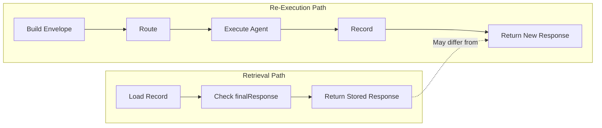

# Retrieval Semantics

This document provides a detailed specification of IntentusNet's historical response retrieval behavior, including edge cases and guarantees.

## Core Retrieval Contract

```
RETRIEVAL CONTRACT:
Given an ExecutionRecord R with finalResponse stored,
retrieve(R) returns R.finalResponse exactly, with no agent execution.
```

:::warning Terminology Clarification
This operation was previously called "replay." That term incorrectly implied re-execution. The operation is now called **retrieval** because it is a lookup of stored data, not a validation that the current system would produce the same result.
:::

## HistoricalResponseEngine Implementation

```python
class HistoricalResponseEngine:
    RETRIEVAL_WARNING = (
        "This is the RECORDED response from execution time. "
        "No agent code was executed. No routing occurred. "
        "This is a historical lookup, NOT re-execution. "
        "For comparing current system behavior with historical executions, "
        "use 'intentusnet records diff' instead."
    )

    def __init__(self, record: ExecutionRecord):
        self._record = record

    def is_retrievable(self) -> Tuple[bool, Optional[str]]:
        """Check if record has a stored response."""
        if self._record.finalResponse is None:
            return False, "execution_incomplete"
        return True, None

    def retrieve(self) -> RetrievalResult:
        """Return stored response without re-execution."""
        ok, reason = self.is_retrievable()
        if not ok:
            raise NotRetrievableError(reason)

        return RetrievalResult(
            execution_id=self._record.header.executionId,
            response=self._record.finalResponse,
            warning=self.RETRIEVAL_WARNING,
            envelope_hash_ok=self._verify_envelope_hash(),
            retrieval_timestamp=now_iso()
        )

    def _verify_envelope_hash(self) -> bool:
        """Verify envelope hash is intact."""
        computed = compute_envelope_hash(self._record.envelope)
        return computed == self._record.header.envelopeHash
```

## Retrievability States

### State 1: Fully Retrievable

```json
{
  "header": {
    "executionId": "exec-a1b2c3d4"
  },
  "finalResponse": {
    "status": "success",
    "payload": {...}
  }
}
```

**Retrieval behavior:** Returns `finalResponse` exactly.

### State 2: Execution Incomplete

```json
{
  "header": {
    "executionId": "exec-e5f6g7h8"
  },
  "finalResponse": null
}
```

**Retrieval behavior:** Raises `NotRetrievableError("execution_incomplete")`.

### State 3: Recording Failure

```json
{
  "header": {
    "executionId": "exec-m3n4o5p6",
    "recordingFailed": true
  },
  "finalResponse": null
}
```

**Retrieval behavior:** Raises error. No response was stored.

## Retrieval vs Re-Execution



### Key Differences

| Aspect | Retrieval | Re-Execution |
|--------|-----------|--------------|
| Agent called | No | Yes |
| Model API called | No | Yes |
| Side effects | None | May occur |
| Latency | ~1ms | 100ms+ |
| Cost | $0 | API costs |
| Output | Stored exactly | May differ |
| Validates current behavior | **No** | Yes |

## Retrieval Result Structure

```python
@dataclass
class RetrievalResult:
    execution_id: str
    response: Dict[str, Any]
    warning: str  # Mandatory clarification
    envelope_hash_ok: bool
    retrieval_timestamp: str
```

### Identifying Retrievals

```python
result = engine.retrieve()

# Warning is always present
print(result.warning)
# "This is the RECORDED response from execution time..."
```

## Envelope Hash Verification

### Hash Computation

```python
def compute_envelope_hash(envelope: dict) -> str:
    """Compute deterministic hash of envelope."""
    stable = {k: v for k, v in envelope.items()
              if k not in ['routingMetadata']}

    canonical = json.dumps(
        stable,
        sort_keys=True,
        separators=(',', ':'),
        ensure_ascii=True,
        default=str
    )

    return f"sha256:{hashlib.sha256(canonical.encode()).hexdigest()}"
```

### Verification in Retrieval

```python
result = engine.retrieve()
if result.envelope_hash_ok:
    print("Envelope integrity verified")
else:
    print("Warning: envelope may have been modified")
```

## Record Integrity

### Checksum Verification

```python
def verify_record_integrity(record: ExecutionRecord) -> bool:
    """Verify record hasn't been tampered with."""
    computed_hash = compute_envelope_hash(record.envelope)
    return computed_hash == record.header.envelopeHash
```

### Event Sequence Verification

```python
def verify_event_sequence(record: ExecutionRecord) -> bool:
    """Verify events are properly ordered."""
    last_seq = 0
    for event in record.events:
        if event.seq <= last_seq:
            return False
        last_seq = event.seq
    return True
```

## Edge Cases

### Empty Payload

```python
record.finalResponse = {"status": "success", "payload": None}
# Retrieval returns: RetrievalResult(response={"status": "success", "payload": None}, ...)
```

### Error Response

```python
record.finalResponse = {
    "status": "error",
    "error": {"code": "AGENT_ERROR", "message": "Failed"}
}
# Retrieval returns the error, not success
```

### Large Payloads

```python
record.finalResponse = {"payload": {"data": "..." * 1000000}}
# Retrieval returns full stored payload
```

## What Retrieval Does NOT Do

### Does NOT Validate Current Behavior

Retrieval does not check if the current system would produce the same result:

```python
# To compare current behavior with stored response:
# Use intentusnet records diff, or:
stored = engine.retrieve()
current = router.route_intent(envelope)
assert stored.response == current.to_dict()  # Manual comparison
```

### Does NOT Re-Execute

No agent code runs. No routing logic runs. This is a lookup.

### Does NOT Update State

Retrieving does not modify any external state:

```python
# Original execution wrote to database
# Retrieval does NOT write to database again
result = engine.retrieve()  # Database unchanged
```

## Summary

| Aspect | Behavior |
|--------|----------|
| Operation type | Lookup |
| Output | Stored response exactly |
| Agent execution | None |
| Model calls | None |
| Validates current behavior | No |
| Warning | Always included |

## See Also

- [Historical Response Retrieval](../guarantees/historical-retrieval) — Guarantee specification
- [`intentusnet retrieve`](../cli/retrieve) — CLI command
