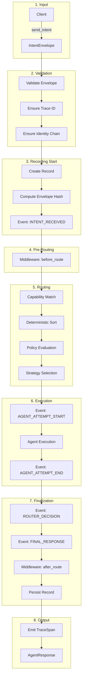

# Data Flow

This document traces the complete flow of an intent from client submission to response, detailing each processing stage.

## End-to-End Flow



## Stage 1: Input

The client creates and sends an intent:

```python
from intentusnet import IntentusClient, Priority

client = IntentusClient(transport)
response = client.send_intent(
    intent_name="ProcessIntent",
    payload={"document_id": "doc-123"},
    priority=Priority.NORMAL,
    tags=["batch", "nightly"]
)
```

This creates an `IntentEnvelope`:

```json
{
  "version": "1.0",
  "intent": {
    "name": "ProcessIntent",
    "version": "1.0"
  },
  "payload": {
    "document_id": "doc-123"
  },
  "context": {
    "sourceAgent": "client",
    "timestamp": "2024-01-15T10:30:00Z",
    "priority": "NORMAL",
    "tags": ["batch", "nightly"]
  },
  "metadata": {
    "requestId": "req-a1b2c3d4",
    "source": "client",
    "createdAt": "2024-01-15T10:30:00Z",
    "traceId": null,
    "identityChain": []
  },
  "routing": {
    "strategy": "DIRECT",
    "targetAgent": null,
    "fallbackAgents": []
  }
}
```

## Stage 2: Validation

The router validates the envelope:

```python
def validate_envelope(env: IntentEnvelope) -> None:
    # Version check
    if env.version != "1.0":
        raise ValidationError("Unsupported version")

    # Required fields
    if not env.intent.name:
        raise ValidationError("Intent name required")

    # Trace ID generation if missing
    if not env.metadata.traceId:
        env.metadata.traceId = generate_trace_id()

    # Identity chain initialization
    if not env.metadata.identityChain:
        env.metadata.identityChain = []
```

## Stage 3: Recording Start

If recording is enabled, the execution record is created:

```python
record = ExecutionRecord.new(envelope)
# record.header.executionId = "exec-e5f6g7h8"
# record.header.envelopeHash = "sha256:..."
# record.header.replayable = True

recorder.record_event(ExecutionEvent(
    seq=1,
    type="INTENT_RECEIVED",
    payload={"intent": envelope.intent.name}
))
```

## Stage 4: Pre-Routing Middleware

Middleware hooks run before routing:

```python
for middleware in self.middleware:
    middleware.before_route(envelope)
    # Logging, metrics, validation, etc.
```

Example middleware:

```python
class LoggingMiddleware:
    def before_route(self, env: IntentEnvelope) -> None:
        log.info("Routing intent",
            intent=env.intent.name,
            request_id=env.metadata.requestId)
```

## Stage 5: Routing

### 5a. Capability Matching

Find agents that handle this intent:

```python
matching_agents = registry.find_by_capability(
    intent_name=envelope.intent.name,
    intent_version=envelope.intent.version
)
# Returns: [agent-a, agent-b, agent-c]
```

### 5b. Deterministic Sort

Order agents deterministically:

```python
sorted_agents = sorted(
    matching_agents,
    key=lambda a: (
        0 if a.nodeId is None else 1,  # Local first
        a.nodePriority,                 # Lower priority first
        a.name                          # Alphabetical tiebreaker
    )
)
# Returns: [agent-a, agent-b, agent-c] (in deterministic order)
```

### 5c. Policy Evaluation

Apply policy rules:

```python
evaluated = policy_engine.evaluate(envelope, sorted_agents)
# Returns: {
#   "allowed": ["agent-a", "agent-b"],
#   "filtered": ["agent-c"],
#   "reasons": {"agent-c": "security_policy"}
# }
```

### 5d. Strategy Selection

Apply routing strategy:

```python
match envelope.routing.strategy:
    case RoutingStrategy.DIRECT:
        selected = [sorted_agents[0]]
    case RoutingStrategy.FALLBACK:
        selected = sorted_agents  # Try in order
    case RoutingStrategy.BROADCAST:
        selected = sorted_agents  # Execute all
    case RoutingStrategy.PARALLEL:
        selected = sorted_agents  # Execute concurrently
```

## Stage 6: Execution

### 6a. Agent Attempt Start

```python
recorder.record_event(ExecutionEvent(
    seq=2,
    type="AGENT_ATTEMPT_START",
    payload={"agent": selected_agent.name, "attempt": 1}
))
```

### 6b. Agent Execution

```python
try:
    response = agent.handle(envelope)
except Exception as e:
    response = AgentResponse.failure(
        ErrorInfo(code=ErrorCode.INTERNAL_AGENT_ERROR, message=str(e)),
        agent=agent.name
    )
```

### 6c. Agent Attempt End

```python
recorder.record_event(ExecutionEvent(
    seq=3,
    type="AGENT_ATTEMPT_END",
    payload={
        "agent": selected_agent.name,
        "status": response.status,
        "latency_ms": elapsed_ms
    }
))
```

### Fallback Handling

If using FALLBACK strategy and agent fails:

```python
recorder.record_event(ExecutionEvent(
    seq=4,
    type="FALLBACK_TRIGGERED",
    payload={
        "from_agent": failed_agent.name,
        "to_agent": next_agent.name,
        "reason": response.error.code
    }
))
# Continue with next agent
```

## Stage 7: Finalization

### 7a. Router Decision

```python
recorder.record_event(ExecutionEvent(
    seq=5,
    type="ROUTER_DECISION",
    payload={
        "agent": final_agent.name,
        "intent": envelope.intent.name,
        "reason": "deterministic_match"
    }
))
```

### 7b. Final Response

```python
recorder.record_event(ExecutionEvent(
    seq=6,
    type="FINAL_RESPONSE",
    payload={
        "status": response.status,
        "has_error": response.error is not None
    }
))
```

### 7c. Post-Routing Middleware

```python
for middleware in reversed(self.middleware):
    middleware.after_route(envelope, response)
    # Logging, metrics, cleanup
```

### 7d. Persist Record

```python
record.finalResponse = response.to_dict()
store.save(record)
# Saved to: .intentusnet/records/exec-e5f6g7h8.json
```

## Stage 8: Output

### TraceSpan Emission

```python
trace_sink.emit(TraceSpan(
    agent=final_agent.name,
    intent=envelope.intent.name,
    status=response.status,
    latencyMs=total_latency_ms,
    error=response.error.message if response.error else None
))
```

### Response Return

```python
return AgentResponse(
    version="1.0",
    status="success",
    payload={"result": "processed"},
    metadata={
        "execution_id": record.header.executionId,
        "agent": final_agent.name,
        "latency_ms": total_latency_ms,
        "replayable": True
    }
)
```

## Complete Event Sequence

For a successful FALLBACK execution with one failure:

```json
{
  "events": [
    {"seq": 1, "type": "INTENT_RECEIVED", "payload": {"intent": "ProcessIntent"}},
    {"seq": 2, "type": "AGENT_ATTEMPT_START", "payload": {"agent": "agent-a", "attempt": 1}},
    {"seq": 3, "type": "AGENT_ATTEMPT_END", "payload": {"agent": "agent-a", "status": "error"}},
    {"seq": 4, "type": "FALLBACK_TRIGGERED", "payload": {"from": "agent-a", "to": "agent-b"}},
    {"seq": 5, "type": "AGENT_ATTEMPT_START", "payload": {"agent": "agent-b", "attempt": 2}},
    {"seq": 6, "type": "AGENT_ATTEMPT_END", "payload": {"agent": "agent-b", "status": "success"}},
    {"seq": 7, "type": "ROUTER_DECISION", "payload": {"agent": "agent-b"}},
    {"seq": 8, "type": "FINAL_RESPONSE", "payload": {"status": "success"}}
  ]
}
```

## Data Flow Summary

| Stage | Input | Output | Side Effects |
|-------|-------|--------|--------------|
| Input | Client call | IntentEnvelope | None |
| Validation | Envelope | Validated envelope | Trace ID added |
| Recording Start | Envelope | ExecutionRecord | Event recorded |
| Pre-Middleware | Envelope | (modified envelope) | Logging, metrics |
| Routing | Envelope + Agents | Selected agents | Policy filtering |
| Execution | Envelope + Agent | AgentResponse | Agent side effects |
| Finalization | Response + Record | Complete record | Record persisted |
| Output | Record | Final response | TraceSpan emitted |

## Next Steps

- [Determinism Model](./determinism-model) — Where determinism is enforced
- [Failure Model](./failure-model) — How failures are handled
