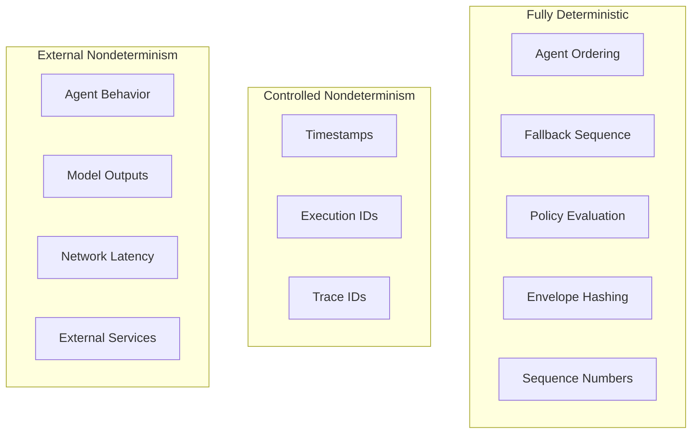
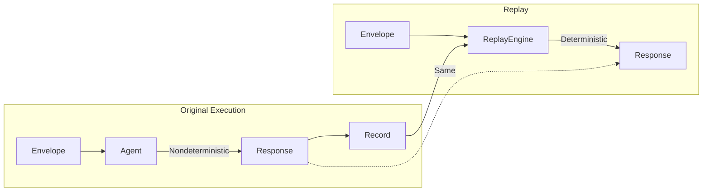

# Determinism Model

IntentusNet enforces determinism at specific boundaries while allowing nondeterminism where appropriate. This document maps out exactly where each applies.

## Determinism Boundaries



## Fully Deterministic Operations

These operations produce identical results given identical inputs:

### 1. Agent Ordering

```python
# DETERMINISTIC: Same agents + same intent = same order
def compute_order(agents: List[AgentDefinition]) -> List[AgentDefinition]:
    return sorted(agents, key=lambda a: (
        0 if a.nodeId is None else 1,
        a.nodePriority,
        a.name
    ))
```

**Guarantee:** The ordering algorithm has no randomness, no timestamp dependencies, and no external state.

### 2. Fallback Sequence

```python
# DETERMINISTIC: Fallback order matches agent ordering
for agent in ordered_agents:
    response = agent.handle(envelope)
    if response.status == "success":
        break
```

**Guarantee:** Agents are tried in the same order every time.

### 3. Policy Evaluation

```python
# DETERMINISTIC: Same rules + same envelope = same decision
for rule in policy_rules:
    if rule.matches(envelope):
        return rule.action
```

**Guarantee:** Policy rules are evaluated in definition order with no external dependencies.

### 4. Envelope Hashing

```python
# DETERMINISTIC: Same envelope = same hash
def compute_hash(envelope: dict) -> str:
    canonical = json.dumps(envelope, sort_keys=True, separators=(',', ':'))
    return f"sha256:{hashlib.sha256(canonical.encode()).hexdigest()}"
```

**Guarantee:** Canonical JSON serialization ensures stable hashing.

### 5. Sequence Numbers

```python
# DETERMINISTIC: Events numbered sequentially
class DeterministicClock:
    def __init__(self):
        self._seq = 0

    def next(self) -> int:
        self._seq += 1
        return self._seq
```

**Guarantee:** No wall-clock dependencies, pure sequence.

## Controlled Nondeterminism

These operations are nondeterministic but their outputs are captured for replay:

### 1. Timestamps

```python
# NONDETERMINISTIC at creation, DETERMINISTIC on replay
timestamp = datetime.utcnow().isoformat()
record.header.createdUtcIso = timestamp
# Replay uses recorded timestamp
```

**Handling:** Timestamps are recorded; replay returns recorded values.

### 2. Execution IDs

```python
# NONDETERMINISTIC at creation
execution_id = f"exec-{secrets.token_hex(8)}"
# But stable for the lifetime of the record
```

**Handling:** Generated once, then immutable in the record.

### 3. Trace IDs

```python
# NONDETERMINISTIC if not provided
if not envelope.metadata.traceId:
    envelope.metadata.traceId = generate_trace_id()
```

**Handling:** Generated if missing, but recorded; replay preserves the value.

## External Nondeterminism

These are outside IntentusNet's control:

### 1. Agent Behavior

```python
class MyAgent(BaseAgent):
    def handle_intent(self, env: IntentEnvelope) -> AgentResponse:
        # This may call an LLM, access databases, etc.
        # IntentusNet doesn't control this
        result = self.llm.generate(env.payload["prompt"])
        return AgentResponse.success({"result": result}, agent=self.name)
```

**Handling:** IntentusNet records the response, enabling deterministic replay.

### 2. Model Outputs

```python
# LLM outputs are nondeterministic
response = openai.chat.completions.create(
    model="gpt-4",
    messages=[{"role": "user", "content": prompt}]
)
# May differ between calls, even with temperature=0
```

**Handling:** The output is recorded; replay returns the recorded output.

### 3. Network Latency

```python
# Timing varies
start = time.time()
response = agent.handle(envelope)
latency = time.time() - start  # Varies each run
```

**Handling:** Latency is recorded for observability but doesn't affect determinism.

### 4. External Services

```python
# External service state is unknown
response = requests.get("https://api.example.com/data")
# May return different data each time
```

**Handling:** The response is captured in the agent's output.

## Determinism Verification

You can verify determinism properties:

```python
def test_routing_determinism():
    """Verify routing is deterministic."""
    runtime = IntentusRuntime()
    register_test_agents(runtime)

    envelope = create_test_envelope()

    # Run 100 times
    selections = []
    for _ in range(100):
        # Disable recording to avoid side effects
        response = runtime.router.route_intent(envelope)
        selections.append(response.metadata["selected_agent"])

    # All should be identical
    assert len(set(selections)) == 1

def test_hash_determinism():
    """Verify hashing is deterministic."""
    envelope = create_test_envelope()

    hashes = [compute_envelope_hash(envelope.to_dict()) for _ in range(100)]

    assert len(set(hashes)) == 1
```

## Replay Determinism

Replay is deterministic because it doesn't re-execute:



## Breaking Determinism

Avoid these patterns that break determinism:

### Don't: Random Agent Selection

```python
# BAD: Non-deterministic
import random
selected = random.choice(matching_agents)
```

### Don't: Time-Based Selection

```python
# BAD: Non-deterministic
if datetime.now().hour < 12:
    selected = morning_agent
else:
    selected = afternoon_agent
```

### Don't: External State in Routing

```python
# BAD: Non-deterministic
load = get_agent_load(agent)
if load < 0.5:
    selected = agent
```

## Preserving Determinism

These patterns preserve determinism:

### Do: Configuration-Based Priority

```python
# GOOD: Deterministic
AgentDefinition(name="primary", nodePriority=10)
AgentDefinition(name="fallback", nodePriority=100)
```

### Do: Explicit Targeting

```python
# GOOD: Deterministic
RoutingOptions(targetAgent="specific-agent")
```

### Do: Version-Based Selection

```python
# GOOD: Deterministic
Capability(intent=IntentRef(name="Process", version="2.0"))
```

## Summary Table

| Operation | Deterministic? | Recorded? | Replayable? |
|-----------|---------------|-----------|-------------|
| Agent ordering | Yes | N/A | N/A |
| Fallback sequence | Yes | Yes | Yes |
| Policy evaluation | Yes | Yes | Yes |
| Envelope hash | Yes | Yes | Yes |
| Sequence numbers | Yes | Yes | Yes |
| Timestamps | No | Yes | Yes |
| Execution ID | No | Yes | Yes |
| Agent behavior | No | Yes | Yes |
| Model output | No | Yes | Yes |
| Network latency | No | Yes | N/A |

## Provable Determinism (v4.5)

IntentusNet v4.5 extends the determinism model with **provable guarantees**:

### Execution Fingerprinting

Every execution produces a SHA-256 fingerprint computed from the intent sequence, agent call sequence, parameter hashes, output hashes, retry pattern, execution order, and timeout values. If the fingerprint changes between runs with identical input, nondeterminism is detected automatically.

### Drift Detection

When a nondeterministic agent is introduced (e.g., one that uses `random.random()` without a seed), the execution fingerprint changes across runs. The CI pipeline detects this as **drift** and blocks deployment.

### Deterministic-Safe CI/CD

A 9-gate verification pipeline enforces determinism before deployment:

| Gate | Verification |
|------|-------------|
| Build Reproducibility | Same source → same binary SHA-256 |
| Deterministic Execution | Same input → same fingerprint |
| WAL Replay Final-State | Replayed response matches original |
| Entropy Detection | No unseeded randomness in critical paths |
| Container Reproducibility | Same Dockerfile → same image hash |
| Routing Determinism | Same capabilities → same agent selection |
| Crash Recovery | Side-effect-aware resume/block |
| WAL Integrity & Tamper | Hash chain + signature verification |
| Runtime Snapshot | Serialization round-trip integrity |

All 9 gates must pass before deployment.

## Next Steps

- [Failure Model](./failure-model) — How failures interact with determinism
- [Replay Semantics](../advanced/replay-semantics) — Deep dive on replay
