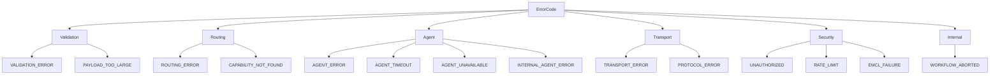

# Failure Model

IntentusNet has an explicit failure model. Every failure is categorized, recorded, and surfaced with typed error codes. This document covers the complete failure taxonomy.

## Error Code Taxonomy



## Error Code Reference

| Code | Category | Retryable | Description |
|------|----------|-----------|-------------|
| `VALIDATION_ERROR` | Validation | No | Invalid input envelope |
| `PAYLOAD_TOO_LARGE` | Validation | No | Payload exceeds size limit |
| `ROUTING_ERROR` | Routing | Maybe | General routing failure |
| `CAPABILITY_NOT_FOUND` | Routing | No | No agent handles intent |
| `AGENT_ERROR` | Agent | Maybe | Agent returned error |
| `AGENT_TIMEOUT` | Agent | Yes | Agent execution timeout |
| `AGENT_UNAVAILABLE` | Agent | Yes | Agent not reachable |
| `INTERNAL_AGENT_ERROR` | Agent | Maybe | Unhandled exception in agent |
| `TRANSPORT_ERROR` | Transport | Yes | Transport layer failure |
| `PROTOCOL_ERROR` | Transport | No | Protocol violation |
| `UNAUTHORIZED` | Security | No | Access denied |
| `RATE_LIMIT` | Security | Yes | Rate limit exceeded |
| `EMCL_FAILURE` | Security | No | Encryption/decryption failure |
| `WORKFLOW_ABORTED` | Internal | No | Workflow terminated |

## Failure Scenarios

### Scenario 1: Invalid Envelope

```python
envelope = IntentEnvelope(
    version="2.0",  # Unsupported version
    intent=IntentRef(name="", version="1.0"),  # Empty intent name
    # ...
)

response = router.route_intent(envelope)
# response.status == "error"
# response.error.code == ErrorCode.VALIDATION_ERROR
# response.error.message == "Invalid envelope: unsupported version"
# response.error.retryable == False
```

### Scenario 2: No Matching Agent

```python
envelope = IntentEnvelope(
    intent=IntentRef(name="UnknownIntent", version="1.0"),
    # ...
)

response = router.route_intent(envelope)
# response.status == "error"
# response.error.code == ErrorCode.CAPABILITY_NOT_FOUND
# response.error.message == "No agent found for intent: UnknownIntent/1.0"
```

### Scenario 3: Agent Failure with Fallback

```python
# FALLBACK strategy
envelope.routing = RoutingOptions(strategy=RoutingStrategy.FALLBACK)

# Agent A fails, Agent B succeeds
response = router.route_intent(envelope)
# response.status == "success"
# Execution record shows:
# - AGENT_ATTEMPT_START (agent-a)
# - AGENT_ATTEMPT_END (agent-a, status=error)
# - FALLBACK_TRIGGERED (agent-a → agent-b)
# - AGENT_ATTEMPT_START (agent-b)
# - AGENT_ATTEMPT_END (agent-b, status=success)
```

### Scenario 4: All Fallbacks Fail

```python
# All agents fail
response = router.route_intent(envelope)
# response.status == "error"
# response.error == last agent's error
# Execution record shows all attempts
```

### Scenario 5: Agent Exception

```python
class BuggyAgent(BaseAgent):
    def handle_intent(self, env: IntentEnvelope) -> AgentResponse:
        raise ValueError("Unexpected error")

response = router.route_intent(envelope)
# response.status == "error"
# response.error.code == ErrorCode.INTERNAL_AGENT_ERROR
# response.error.message == "Unexpected error"
# Exception is caught, not propagated
```

### Scenario 6: Transport Failure

```python
transport = HTTPTransport("http://unreachable:8080")
client = IntentusClient(transport)

response = client.send_intent("ProcessIntent", {})
# response.status == "error"
# response.error.code == ErrorCode.TRANSPORT_ERROR
# response.error.retryable == True
```

## Crash Failure Handling

### Mid-Execution Crash

```
Timeline:
  t0: INTENT_RECEIVED recorded
  t1: AGENT_ATTEMPT_START recorded
  t2: Agent begins processing
  t3: CRASH
```

**State after restart:**
- Execution record exists with events [t0, t1]
- `replayable: false`
- `replayableReason: "execution_incomplete"`

**Recovery options:**
1. Inspect to understand failure point
2. Assess if agent had side effects
3. Decide: retry, skip, or manual intervention

### Post-Execution Crash

```
Timeline:
  t0-t5: Normal execution
  t6: FINAL_RESPONSE recorded
  t7: Response being returned
  t8: CRASH
```

**State after restart:**
- Complete execution record exists
- `replayable: true`
- Client may not have received response

**Recovery:**
- Replay returns the recorded response
- No re-execution needed

## Error Propagation

Errors are normalized and propagated consistently:


```python
try:
    result = agent.handle(envelope)
except TimeoutError:
    error = ErrorInfo(
        code=ErrorCode.AGENT_TIMEOUT,
        message="Agent did not respond in time",
        retryable=True,
        details={"agent": agent.name, "timeout_ms": 30000}
    )
    result = AgentResponse.failure(error, agent=agent.name)
except Exception as e:
    error = ErrorInfo(
        code=ErrorCode.INTERNAL_AGENT_ERROR,
        message=str(e),
        retryable=False,
        details={"agent": agent.name, "exception_type": type(e).__name__}
    )
    result = AgentResponse.failure(error, agent=agent.name)
```

## Idempotency Requirements

IntentusNet doesn't provide automatic rollback. Design agents for idempotency:

```python
class IdempotentAgent(BaseAgent):
    def handle_intent(self, env: IntentEnvelope) -> AgentResponse:
        request_id = env.metadata.requestId

        # Check if already processed
        existing = self.get_cached(request_id)
        if existing:
            return existing

        # Process
        result = self.process(env.payload)

        # Cache before returning
        response = AgentResponse.success(result, agent=self.name)
        self.cache(request_id, response)

        return response
```

## Failure Recording

All failures are recorded in execution events:

```json
{
  "events": [
    {
      "seq": 1,
      "type": "INTENT_RECEIVED",
      "payload": {"intent": "ProcessIntent"}
    },
    {
      "seq": 2,
      "type": "AGENT_ATTEMPT_START",
      "payload": {"agent": "processor-a"}
    },
    {
      "seq": 3,
      "type": "AGENT_ATTEMPT_END",
      "payload": {
        "agent": "processor-a",
        "status": "error",
        "error_code": "AGENT_TIMEOUT",
        "latency_ms": 30000
      }
    },
    {
      "seq": 4,
      "type": "FINAL_RESPONSE",
      "payload": {
        "status": "error",
        "error_code": "AGENT_TIMEOUT"
      }
    }
  ]
}
```

## Retry Guidance

| Error Code | Should Retry? | Backoff? |
|------------|---------------|----------|
| `VALIDATION_ERROR` | No | N/A |
| `CAPABILITY_NOT_FOUND` | No | N/A |
| `AGENT_TIMEOUT` | Yes | Exponential |
| `AGENT_UNAVAILABLE` | Yes | Exponential |
| `TRANSPORT_ERROR` | Yes | Exponential |
| `RATE_LIMIT` | Yes | Use Retry-After |
| `INTERNAL_AGENT_ERROR` | Maybe | Depends on cause |
| `UNAUTHORIZED` | No | N/A |

## Failure Inspection

Use CLI to inspect failures:

```bash
# List failed executions
$ intentusnet inspect --list --status error

# Examine specific failure
$ intentusnet inspect exec-e5f6g7h8
{
  "execution_id": "exec-e5f6g7h8",
  "status": "error",
  "error": {
    "code": "AGENT_TIMEOUT",
    "message": "Agent processor-a did not respond",
    "retryable": true
  },
  "events": [...]
}

# Filter by error code
$ intentusnet inspect --list --error-code AGENT_TIMEOUT
```

## Summary

| Aspect | Behavior |
|--------|----------|
| Error taxonomy | Typed ErrorCode enum |
| Error propagation | Normalized AgentResponse |
| Exception handling | Caught and wrapped |
| Recording | All failures recorded |
| Automatic retry | NOT provided |
| Rollback | NOT provided |

## Next Steps

- [Security Model](./security-model) — Security-related failures
- [Crash Safety Internals](../advanced/crash-safety-internals) — Recovery mechanisms
