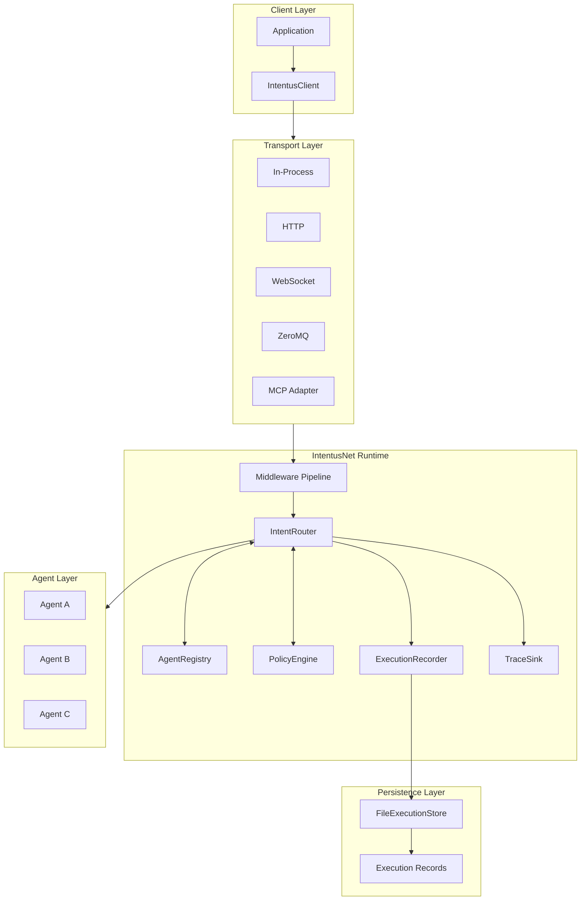
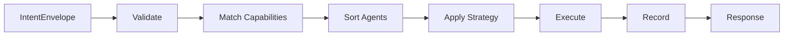
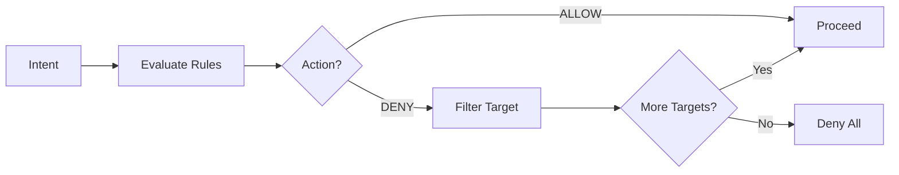
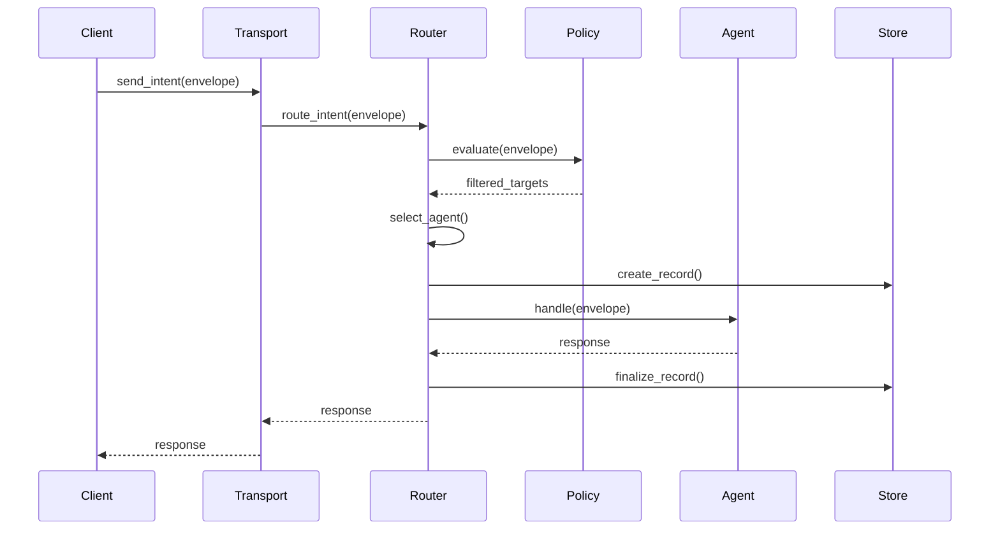
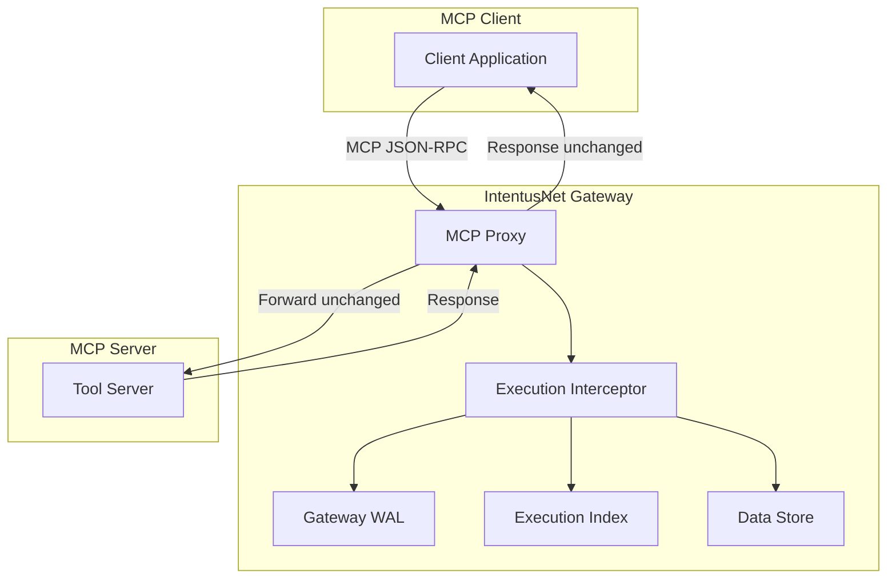
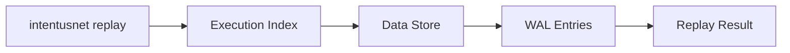

# Architecture Overview

IntentusNet is designed as a layered runtime with clear separation of concerns. This document provides a high-level view of the system architecture.

## System Architecture



## Core Components

### 1. IntentusClient

The client API for sending intents:

```python
from intentusnet import IntentusClient

client = IntentusClient(transport)
response = client.send_intent(
    intent_name="ProcessIntent",
    payload={"data": "input"},
    priority=Priority.NORMAL
)
```

**Responsibilities:**
- Build valid `IntentEnvelope`
- Delegate to transport
- Return `AgentResponse`

### 2. Transport Layer

Protocol abstraction for wire communication:

| Transport | Use Case |
|-----------|----------|
| `InProcessTransport` | Same-process routing, testing |
| `HTTPTransport` | Remote HTTP endpoints |
| `WebSocketTransport` | Persistent connections |
| `ZeroMQTransport` | High-performance messaging |
| `MCPAdapter` | MCP protocol bridge |

### 3. IntentRouter

The deterministic routing engine:



**Responsibilities:**
- Capability matching
- Deterministic agent ordering
- Strategy execution (DIRECT, FALLBACK, BROADCAST, PARALLEL)
- Execution recording
- Trace emission

### 4. AgentRegistry

Central agent storage and lookup:

```python
from intentusnet import AgentRegistry

registry = AgentRegistry()
registry.register(agent_definition)
agents = registry.find_by_capability("ProcessIntent", "1.0")
```

**Features:**
- Agent registration/deregistration
- Capability-based lookup
- Health tracking
- Deterministic ordering support

### 5. PolicyEngine

Policy evaluation and filtering:



### 6. ExecutionRecorder

Records execution for replay:

```python
from intentusnet import ExecutionRecord, InMemoryExecutionRecorder

recorder = InMemoryExecutionRecorder()
recorder.record_event(ExecutionEvent(seq=1, type="INTENT_RECEIVED", ...))
record = recorder.finalize()
```

### 7. TraceSink

Collects trace spans:

```python
class TraceSink(Protocol):
    def emit(span: TraceSpan) -> None:
        """Emit a trace span for collection."""
```

## Component Interaction



## Data Structures

### IntentEnvelope

The canonical wire-level representation:

```python
@dataclass
class IntentEnvelope:
    version: str              # Protocol version ("1.0")
    intent: IntentRef         # Intent name + version
    payload: Dict[str, Any]   # Input data
    context: IntentContext    # Source, timestamp, priority
    metadata: IntentMetadata  # Request ID, trace ID
    routing: RoutingOptions   # Strategy, targets
    routingMetadata: Dict     # Decision tracking
```

### AgentResponse

Unified response format:

```python
@dataclass
class AgentResponse:
    version: str                      # "1.0"
    status: str                       # "success" | "error"
    payload: Optional[Dict[str, Any]] # Result data
    metadata: Dict[str, Any]          # Execution metadata
    error: Optional[ErrorInfo]        # Error details if failed
```

## Layered Design

```
┌─────────────────────────────────────────┐
│            Application Code             │
├─────────────────────────────────────────┤
│            IntentusClient               │
├─────────────────────────────────────────┤
│           Transport Layer               │
├─────────────────────────────────────────┤
│   ┌─────────────────────────────────┐   │
│   │     Middleware Pipeline         │   │
│   ├─────────────────────────────────┤   │
│   │     IntentRouter               │   │
│   │  ┌────────┬────────┬────────┐  │   │
│   │  │Registry│ Policy │Recorder│  │   │
│   │  └────────┴────────┴────────┘  │   │
│   └─────────────────────────────────┘   │
├─────────────────────────────────────────┤
│           Persistence Layer             │
├─────────────────────────────────────────┤
│              Agent Layer                │
└─────────────────────────────────────────┘
```

## MCP Gateway Architecture

The Deterministic MCP Gateway operates as a transparent proxy layer between MCP clients and servers:



### Gateway Data Flow

1. MCP client sends JSON-RPC request to the gateway
2. Gateway intercepts tool-related methods (`tools/call`, `tools/list`, etc.)
3. Execution interceptor writes `execution_start` to WAL (durability boundary)
4. Request is forwarded to the MCP server unmodified
5. Response is received from the MCP server
6. Execution interceptor writes `execution_end` to WAL
7. Full execution data is persisted to the data store
8. Execution index is updated
9. Response is returned to the client unmodified

The gateway adds no protocol changes. Clients and servers are unaware of its presence.

### Gateway Components

| Component | Purpose |
|-----------|---------|
| **MCP Proxy** | Transparent stdio/HTTP relay |
| **Execution Interceptor** | Records tool calls with WAL entries |
| **Gateway WAL** | Append-only, hash-chained, fsync-safe log |
| **Execution Index** | Fast O(1) lookup by execution ID |
| **Data Store** | Full execution data (request, response, seed) |

### Fast Replay

Replay reads from the WAL and data store — no MCP server is contacted:



## Extension Points

IntentusNet is extensible at multiple points:

| Extension Point | Interface | Purpose |
|-----------------|-----------|---------|
| Transport | `Transport` protocol | Custom wire protocols |
| Middleware | `RouterMiddleware` | Request/response hooks |
| Agent | `BaseAgent` | Custom agent implementations |
| Store | `ExecutionStore` | Custom persistence backends |
| TraceSink | `TraceSink` | Custom trace collection |
| EMCLProvider | `EMCLProvider` | Custom encryption |

## Next Steps

- [Data Flow](./data-flow) — Detailed execution flow
- [Determinism Model](./determinism-model) — Where determinism applies
- [Failure Model](./failure-model) — Error handling architecture
- [Security Model](./security-model) — Trust boundaries
