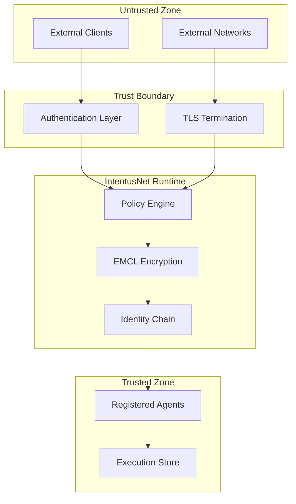

# Security Model

IntentusNet provides security primitives but is not a complete security solution. This document outlines trust boundaries, what the runtime secures, and what requires external solutions.

## Trust Boundaries



## What IntentusNet Secures

### 1. Policy Enforcement

IntentusNet evaluates policies before execution:

```python
PolicyRule(
    id="admin-only-delete",
    action=PolicyAction.DENY,
    intents=["DeleteIntent"],
    agents=["*"],
    roles=["user", "operator"],  # Deny non-admins
    tenants=["*"]
)
```

**Guarantee:** Policies are evaluated synchronously before routing.

### 2. Identity Chain Tracking

The identity chain tracks request provenance:

```python
envelope.metadata.identityChain = [
    "user:alice@example.com",
    "service:api-gateway",
    "agent:router-primary"
]
```

**Guarantee:** Each handler can append to the chain; chain is recorded.

### 3. EMCL Encryption

Optional envelope encryption for sensitive data:

```python
from intentusnet.security import AESGCMEMCLProvider

emcl = AESGCMEMCLProvider(key=encryption_key)
encrypted_envelope = emcl.encrypt(envelope.to_dict())
# Encrypted in transit and at rest
```

**Guarantee:** AES-256-GCM encryption with authenticated encryption.

### 4. Rate Limiting (Policy Layer)

Rate limits via policy rules:

```python
PolicyRule(
    id="rate-limit-api",
    action=PolicyAction.ALLOW,
    intents=["*"],
    rate_limit_per_minute=100,
    rate_limit_key_template="{tenant}:{source}"
)
```

**Guarantee:** Rate limits evaluated at policy layer.

## What IntentusNet Does NOT Secure

### Authentication

IntentusNet does not authenticate users or services:

```python
# IntentusNet does NOT do this:
user = authenticate(request.headers["Authorization"])

# You must provide:
# - OAuth2/OIDC integration
# - JWT validation
# - API key management
```

**Solution:** Use an API gateway, middleware, or auth service.

### TLS/Transport Security

IntentusNet does not handle TLS:

```python
# IntentusNet transports are plain by default
HTTPTransport("http://localhost:8080")  # No TLS

# You must provide:
# - TLS certificates
# - Certificate rotation
# - mTLS for service-to-service
```

**Solution:** Use reverse proxy (nginx, Envoy) or cloud load balancer.

### Secrets Management

IntentusNet does not manage secrets:

```python
# IntentusNet does NOT do this:
api_key = get_secret("openai-api-key")

# You must provide:
# - Vault integration
# - Cloud KMS
# - Environment variable management
```

**Solution:** Use HashiCorp Vault, AWS Secrets Manager, etc.

### Input Sanitization

IntentusNet does not sanitize payloads:

```python
# IntentusNet passes payload as-is
envelope.payload = {"query": "'; DROP TABLE users; --"}
# Agent receives raw payload

# You must provide:
# - SQL injection prevention
# - XSS sanitization
# - Input validation
```

**Solution:** Validate/sanitize in your agents or middleware.

## Security Components

### Policy Engine

```python
from intentusnet.security import PolicyEngine, PolicyRule, PolicyAction

engine = PolicyEngine([
    # Explicit allow for admins
    PolicyRule(
        id="admin-allow",
        action=PolicyAction.ALLOW,
        intents=["*"],
        roles=["admin"],
        tenants=["*"]
    ),
    # Deny dangerous operations for others
    PolicyRule(
        id="deny-dangerous",
        action=PolicyAction.DENY,
        intents=["DeleteIntent", "DestroyIntent"],
        roles=["*"],
        tenants=["*"]
    ),
    # Default allow for safe operations
    PolicyRule(
        id="default-allow",
        action=PolicyAction.ALLOW,
        intents=["*"],
        roles=["*"],
        tenants=["*"]
    ),
])
```

### EMCL Providers

```python
# AES-GCM encryption
from intentusnet.security import AESGCMEMCLProvider

emcl = AESGCMEMCLProvider(
    key=bytes.fromhex("your-256-bit-key-hex"),
    nonce_generator=secure_nonce_generator
)

# Encrypt envelope
encrypted = emcl.encrypt(envelope.to_dict())
# {
#   "version": "1.0",
#   "algorithm": "AES-256-GCM",
#   "nonce": "...",
#   "ciphertext": "...",
#   "tag": "..."
# }

# Decrypt envelope
decrypted = emcl.decrypt(encrypted)
```

### Simple HMAC Signing (Demo)

```python
from intentusnet.security import SimpleHMACEMCLProvider

# For development/testing only
emcl = SimpleHMACEMCLProvider(secret=b"development-secret")
signed = emcl.sign(envelope.to_dict())
```

:::warning Demo Only
`SimpleHMACEMCLProvider` is for demonstration. Use `AESGCMEMCLProvider` or implement a proper provider for production.
:::

## Identity Chain

Track request provenance across agents:

```python
class TrackedAgent(BaseAgent):
    def handle_intent(self, env: IntentEnvelope) -> AgentResponse:
        # Identity chain maintained by BaseAgent
        # self.definition.identity added automatically

        # Log who made the request
        chain = env.metadata.identityChain
        log.info(f"Request from: {chain}")

        # Downstream calls include updated chain
        response = self.emit_intent("SubIntent", payload)
        # Chain now includes this agent's identity
```

### Chain Structure

```json
{
  "identityChain": [
    "user:alice@example.com",          // Original requester
    "gateway:api-gateway-prod",         // API gateway
    "agent:router-primary",             // First agent
    "agent:sub-processor"               // Current agent
  ]
}
```

## Security Best Practices

### 1. Defense in Depth

Don't rely on IntentusNet alone:

```
Internet → WAF → API Gateway → Auth → IntentusNet → Agents
                    ↑              ↑
              Rate Limit      Policy Engine
```

### 2. Least Privilege Policies

```python
# Start with deny-all
PolicyRule(id="deny-all", action=DENY, intents=["*"], ...),

# Explicitly allow what's needed
PolicyRule(id="allow-read", action=ALLOW, intents=["GetIntent", "ListIntent"], ...),
```

### 3. Encrypt Sensitive Payloads

```python
# Enable EMCL for sensitive intents
runtime = IntentusRuntime(
    emcl_provider=AESGCMEMCLProvider(key=key),
    encrypt_intents=["ProcessPII", "HandlePayment"]
)
```

### 4. Audit Identity Chains

```python
# Log and verify identity chains
def audit_chain(env: IntentEnvelope) -> None:
    chain = env.metadata.identityChain
    for identity in chain:
        if is_suspicious(identity):
            log.warning(f"Suspicious identity in chain: {identity}")
```

### 5. Secure Execution Storage

```python
# Encrypt records at rest
store = EncryptedFileExecutionStore(
    base_path=".intentusnet/records",
    encryption_key=storage_key
)
```

## Security Checklist

| Concern | IntentusNet | External |
|---------|-------------|----------|
| Policy enforcement | ✓ | |
| Identity tracking | ✓ | |
| Payload encryption | ✓ (EMCL) | |
| Rate limiting | ✓ (policy) | |
| Authentication | | ✓ |
| TLS termination | | ✓ |
| Secrets management | | ✓ |
| Input validation | | ✓ |
| WAF/DDoS protection | | ✓ |

## Summary

| Aspect | Status |
|--------|--------|
| Policy evaluation | Provided |
| Identity chain | Provided |
| EMCL encryption | Provided |
| Rate limiting | Provided (policy) |
| Authentication | NOT provided |
| TLS/mTLS | NOT provided |
| Secrets | NOT provided |
| Input sanitization | NOT provided |

## Next Steps

- [Policy Design](../advanced/policy-design) — Advanced policy patterns
- [Production Security](../production/security) — Production security guide
