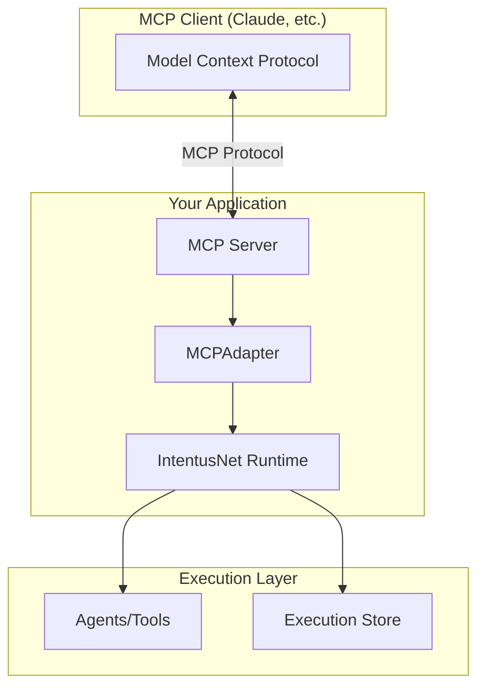

# MCP Compatibility Overview

IntentusNet provides an adapter layer for the Model Context Protocol (MCP), enabling MCP-compatible tools to benefit from IntentusNet's execution guarantees.

## What is MCP?

The Model Context Protocol is a standardized protocol for:
- Tool definitions and discovery
- Context passing between models and tools
- Structured message formats for AI applications

## IntentusNet + MCP

IntentusNet complements MCP by adding:

| MCP Provides | IntentusNet Adds |
|--------------|------------------|
| Tool call format | Deterministic routing |
| Context passing | Execution recording |
| Discovery | Crash recovery |
| Message schema | Replay capability |

## Architecture



## The MCPAdapter

IntentusNet provides `MCPAdapter` to bridge MCP and IntentusNet:

```python
from intentusnet import IntentusClient
from intentusnet.transport import InProcessTransport
from intentusnet.transport.mcp import MCPAdapter

# Create IntentusNet runtime
runtime = IntentusRuntime(enable_recording=True)
transport = InProcessTransport(runtime.router)
client = IntentusClient(transport)

# Create MCP adapter
adapter = MCPAdapter(client)

# Handle MCP tool call
def handle_tool_call(tool_name: str, parameters: dict) -> dict:
    mcp_request = {
        "tool": tool_name,
        "parameters": parameters
    }
    return adapter.handle_mcp_request(mcp_request)
```

## What the Adapter Does

1. **Receives MCP tool call** → Standard MCP format
2. **Converts to IntentEnvelope** → IntentusNet format
3. **Routes through runtime** → All guarantees apply
4. **Records execution** → Auditable, replayable
5. **Returns MCP response** → Standard MCP format

## Benefits

### For MCP Users

- **Replay**: Reproduce exact tool outputs for debugging
- **Audit**: Complete execution records
- **Policy**: Fine-grained access control
- **Recovery**: Handle crashes gracefully

### For Tool Developers

- **Same tools**: No changes to existing MCP tools
- **Added guarantees**: Recording, policy, routing
- **Incremental adoption**: Add IntentusNet to existing MCP setup

## Quick Example

```python
from mcp import Server
from intentusnet import IntentusRuntime
from intentusnet.transport.mcp import MCPAdapter

# Set up IntentusNet
runtime = IntentusRuntime(enable_recording=True)
adapter = MCPAdapter(IntentusClient(InProcessTransport(runtime.router)))

# MCP server with IntentusNet backing
server = Server()

@server.tool("search_documents")
async def search_documents(query: str, limit: int = 10):
    # Route through IntentusNet
    result = adapter.handle_mcp_request({
        "tool": "search_documents",
        "parameters": {"query": query, "limit": limit}
    })

    # IntentusNet provides:
    # - Deterministic routing to search agent
    # - Execution recording
    # - Replay capability

    return result
```

## Compatibility

| MCP Feature | IntentusNet Support |
|-------------|-------------------|
| Tool calls | Full |
| Tool discovery | Via agent registry |
| Context passing | Mapped to IntentContext |
| Streaming | Not currently supported |
| Cancellation | Not currently supported |

## Next Steps

- [Integration Patterns](./integration-patterns) — Detailed integration examples
- [Protocol vs Runtime](./protocol-vs-runtime) — Understanding the distinction
