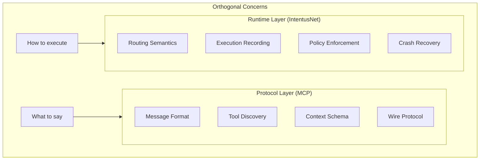

# Protocol vs Runtime

MCP and IntentusNet operate at different layers. Understanding this distinction helps you design better integrations.

## The Distinction



## Protocol Layer (MCP)

MCP defines **how to communicate**:

### Message Format

```json
{
  "jsonrpc": "2.0",
  "method": "tools/call",
  "params": {
    "name": "search_documents",
    "arguments": {
      "query": "climate change",
      "limit": 10
    }
  }
}
```

### Tool Discovery

```json
{
  "tools": [
    {
      "name": "search_documents",
      "description": "Search the document database",
      "inputSchema": {
        "type": "object",
        "properties": {
          "query": {"type": "string"},
          "limit": {"type": "integer"}
        }
      }
    }
  ]
}
```

### What MCP Specifies

| Concern | MCP Specification |
|---------|------------------|
| Message encoding | JSON-RPC 2.0 |
| Tool declaration | Schema format |
| Context passing | Predefined fields |
| Error format | JSON-RPC errors |

### What MCP Doesn't Specify

| Concern | Not Specified |
|---------|--------------|
| Execution order | Up to implementation |
| Retry behavior | Up to implementation |
| Recording | Up to implementation |
| Policy | Up to implementation |

## Runtime Layer (IntentusNet)

IntentusNet defines **how to execute**:

### Routing Semantics

```python
# Deterministic agent selection
agents = registry.find_by_capability("search_documents")
ordered = sort_deterministically(agents)
selected = ordered[0]  # Always the same for same input
```

### Execution Recording

```python
# Every execution recorded
record = ExecutionRecord(
    header=ExecutionHeader(
        executionId="exec-123",
        envelopeHash="sha256:...",
        replayable=True
    ),
    events=[...],
    finalResponse={...}
)
```

### Policy Enforcement

```python
# Policy checked before execution
if not policy_engine.allows(intent, agent, role):
    return PolicyDenialError(...)
```

### What IntentusNet Specifies

| Concern | IntentusNet Specification |
|---------|--------------------------|
| Agent selection | Deterministic ordering |
| Execution recording | Immutable records |
| Replay | Return recorded output |
| Policy | Allow/deny/filter |
| Error codes | Typed enum |

### What IntentusNet Doesn't Specify

| Concern | Not Specified |
|---------|--------------|
| Wire format | Use any transport |
| Tool schema | Use MCP or custom |
| Discovery protocol | Registry-based |

## Complementary Roles

```
┌─────────────────────────────────────────────────────────────┐
│                      Your Application                        │
├─────────────────────────────────────────────────────────────┤
│                                                              │
│   MCP Client (Claude)                                        │
│        │                                                     │
│        ▼                                                     │
│   ┌─────────────────────────────────────────────────────┐   │
│   │                  MCP Server                          │   │
│   │   • Handles JSON-RPC                                 │   │
│   │   • Exposes tool schema                              │   │
│   │   • Parses requests                                  │   │
│   └─────────────────────────────────────────────────────┘   │
│        │                                                     │
│        ▼                                                     │
│   ┌─────────────────────────────────────────────────────┐   │
│   │                 MCPAdapter                           │   │
│   │   • Maps MCP → IntentEnvelope                        │   │
│   │   • Maps AgentResponse → MCP                         │   │
│   └─────────────────────────────────────────────────────┘   │
│        │                                                     │
│        ▼                                                     │
│   ┌─────────────────────────────────────────────────────┐   │
│   │              IntentusNet Runtime                     │   │
│   │   • Deterministic routing                            │   │
│   │   • Execution recording                              │   │
│   │   • Policy enforcement                               │   │
│   │   • Crash recovery                                   │   │
│   └─────────────────────────────────────────────────────┘   │
│        │                                                     │
│        ▼                                                     │
│   ┌─────────────────────────────────────────────────────┐   │
│   │                 Your Tools                           │   │
│   │   • Business logic                                   │   │
│   │   • External API calls                               │   │
│   │   • Database operations                              │   │
│   └─────────────────────────────────────────────────────┘   │
│                                                              │
└─────────────────────────────────────────────────────────────┘
```

## Decision Matrix

| Need | Solution |
|------|----------|
| Expose tools to Claude | MCP |
| Standard message format | MCP |
| Tool discovery | MCP |
| Deterministic routing | IntentusNet |
| Execution recording | IntentusNet |
| Replay capability | IntentusNet |
| Policy enforcement | IntentusNet |
| Crash recovery | IntentusNet |

## Example: Using Both

```python
# MCP Server: Protocol handling
from mcp import Server

server = Server()

@server.list_tools()
async def list_tools():
    # MCP: Tool discovery
    return [
        {"name": "search", "description": "Search docs", ...},
        {"name": "create", "description": "Create doc", ...},
    ]

@server.call_tool()
async def call_tool(name: str, arguments: dict):
    # IntentusNet: Execution semantics
    result = adapter.handle_mcp_request({
        "tool": name,
        "parameters": arguments
    })

    # MCP: Response format
    return {"content": [{"type": "text", "text": json.dumps(result)}]}
```

## When You Need Which

### Need MCP Only

- Prototyping with Claude
- Simple tool exposure
- No audit requirements
- Stateless tools

### Need IntentusNet Only

- Internal agent systems
- No external model clients
- Strong execution guarantees needed
- Custom wire protocols

### Need Both

- Production Claude integration
- Audit/compliance requirements
- Complex multi-tool workflows
- Fallback/reliability needs

## Summary

| Aspect | MCP | IntentusNet |
|--------|-----|-------------|
| Focus | Communication | Execution |
| Scope | Protocol | Runtime |
| Standards | Message format | Execution semantics |
| Complementary | Yes | Yes |

They work together: MCP defines how to talk, IntentusNet defines how to execute reliably.

## See Also

- [MCP Overview](./overview) — MCP basics
- [Integration Patterns](./integration-patterns) — How to integrate
