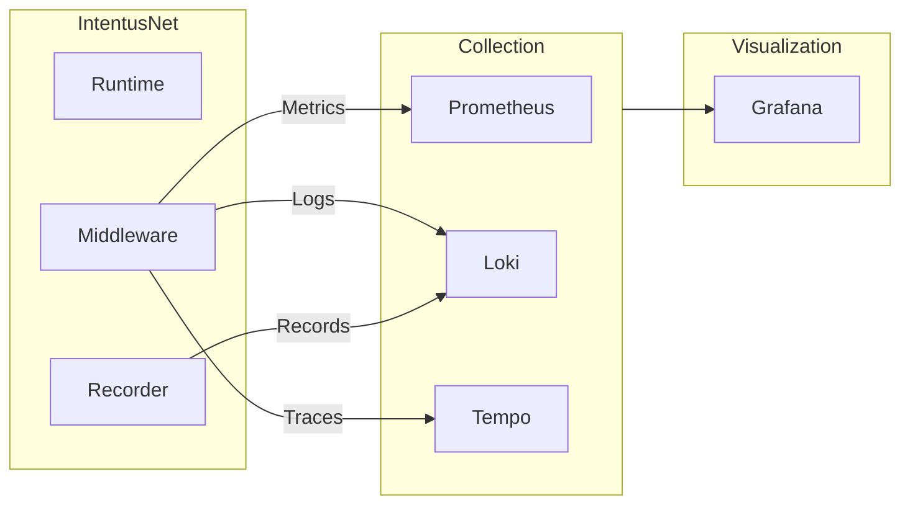

# Production Observability

This guide covers setting up comprehensive observability for IntentusNet in production environments.

## Observability Stack



## Logging

### Structured Logging Setup

```python
import logging
import json

class StructuredFormatter(logging.Formatter):
    def format(self, record):
        log_entry = {
            "timestamp": self.formatTime(record),
            "level": record.levelname,
            "logger": record.name,
            "message": record.getMessage(),
        }
        if hasattr(record, 'execution_id'):
            log_entry["execution_id"] = record.execution_id
        if hasattr(record, 'intent'):
            log_entry["intent"] = record.intent
        if hasattr(record, 'agent'):
            log_entry["agent"] = record.agent
        return json.dumps(log_entry)

# Configure logging
handler = logging.StreamHandler()
handler.setFormatter(StructuredFormatter())
logging.getLogger("intentusnet").addHandler(handler)
logging.getLogger("intentusnet").setLevel(logging.INFO)
```

### Log Output

```json
{"timestamp": "2024-01-15 10:30:00", "level": "INFO", "logger": "intentusnet.router", "message": "Intent routed", "execution_id": "exec-a1b2c3d4", "intent": "ProcessIntent", "agent": "processor-a"}
{"timestamp": "2024-01-15 10:30:00", "level": "INFO", "logger": "intentusnet.router", "message": "Execution completed", "execution_id": "exec-a1b2c3d4", "latency_ms": 127}
```

### Logging Middleware

```python
from intentusnet.middleware import RouterMiddleware

class ProductionLoggingMiddleware(RouterMiddleware):
    def __init__(self, logger):
        self.logger = logger

    def before_route(self, env):
        self.logger.info(
            "Routing intent",
            extra={
                "execution_id": env.metadata.requestId,
                "intent": env.intent.name,
                "source": env.context.sourceAgent
            }
        )

    def after_route(self, env, response):
        self.logger.info(
            "Execution completed",
            extra={
                "execution_id": env.metadata.requestId,
                "status": response.status,
                "agent": response.metadata.get("agent"),
                "latency_ms": response.metadata.get("latency_ms")
            }
        )

    def on_error(self, env, error):
        self.logger.error(
            "Execution failed",
            extra={
                "execution_id": env.metadata.requestId,
                "error_code": error.code.value,
                "error_message": error.message
            }
        )
```

## Metrics

### Prometheus Metrics

```python
from prometheus_client import Counter, Histogram, Gauge

# Counters
intentus_requests_total = Counter(
    'intentus_requests_total',
    'Total intent executions',
    ['intent', 'agent', 'status']
)

intentus_errors_total = Counter(
    'intentus_errors_total',
    'Total execution errors',
    ['intent', 'error_code']
)

# Histograms
intentus_latency_seconds = Histogram(
    'intentus_latency_seconds',
    'Execution latency',
    ['intent', 'agent'],
    buckets=[.01, .025, .05, .1, .25, .5, 1, 2.5, 5, 10]
)

# Gauges
intentus_active_executions = Gauge(
    'intentus_active_executions',
    'Currently executing intents'
)
```

### Metrics Middleware

```python
class MetricsMiddleware(RouterMiddleware):
    def before_route(self, env):
        intentus_active_executions.inc()
        env._start_time = time.time()

    def after_route(self, env, response):
        intentus_active_executions.dec()
        latency = time.time() - env._start_time

        intentus_requests_total.labels(
            intent=env.intent.name,
            agent=response.metadata.get("agent", "unknown"),
            status=response.status
        ).inc()

        intentus_latency_seconds.labels(
            intent=env.intent.name,
            agent=response.metadata.get("agent", "unknown")
        ).observe(latency)

    def on_error(self, env, error):
        intentus_active_executions.dec()

        intentus_errors_total.labels(
            intent=env.intent.name,
            error_code=error.code.value
        ).inc()
```

### Prometheus Exposition

```python
from prometheus_client import start_http_server

# Start metrics server
start_http_server(9090)
```

### Grafana Dashboard Query Examples

```promql
# Request rate by intent
rate(intentus_requests_total[5m])

# Error rate
rate(intentus_errors_total[5m]) / rate(intentus_requests_total[5m])

# P99 latency by agent
histogram_quantile(0.99, rate(intentus_latency_seconds_bucket[5m]))

# Active executions
intentus_active_executions
```

## Tracing

### OpenTelemetry Integration

```python
from opentelemetry import trace
from opentelemetry.sdk.trace import TracerProvider
from opentelemetry.sdk.trace.export import BatchSpanProcessor
from opentelemetry.exporter.otlp.proto.grpc.trace_exporter import OTLPSpanExporter

# Configure tracer
provider = TracerProvider()
processor = BatchSpanProcessor(OTLPSpanExporter(endpoint="http://tempo:4317"))
provider.add_span_processor(processor)
trace.set_tracer_provider(provider)

tracer = trace.get_tracer("intentusnet")
```

### Tracing Middleware

```python
class TracingMiddleware(RouterMiddleware):
    def __init__(self, tracer):
        self.tracer = tracer

    def before_route(self, env):
        env._span = self.tracer.start_span(
            f"intent:{env.intent.name}",
            attributes={
                "intent.name": env.intent.name,
                "intent.version": env.intent.version,
                "request_id": env.metadata.requestId,
                "trace_id": env.metadata.traceId
            }
        )

    def after_route(self, env, response):
        env._span.set_attribute("status", response.status)
        env._span.set_attribute("agent", response.metadata.get("agent"))
        env._span.set_attribute("execution_id", response.metadata.get("execution_id"))
        env._span.end()

    def on_error(self, env, error):
        env._span.set_attribute("error", True)
        env._span.set_attribute("error.code", error.code.value)
        env._span.set_attribute("error.message", error.message)
        env._span.end()
```

## Alerting

### Prometheus Alert Rules

```yaml
groups:
  - name: intentusnet
    rules:
      - alert: HighErrorRate
        expr: rate(intentus_errors_total[5m]) / rate(intentus_requests_total[5m]) > 0.05
        for: 5m
        labels:
          severity: critical
        annotations:
          summary: 'IntentusNet error rate > 5%'

      - alert: HighLatency
        expr: histogram_quantile(0.99, rate(intentus_latency_seconds_bucket[5m])) > 5
        for: 5m
        labels:
          severity: warning
        annotations:
          summary: 'IntentusNet P99 latency > 5s'

      - alert: ExecutionsStuck
        expr: intentus_active_executions > 100
        for: 10m
        labels:
          severity: warning
        annotations:
          summary: 'Many active executions, possible deadlock'
```

## Health Checks

### Health Endpoint

```python
from fastapi import FastAPI, Response

app = FastAPI()

@app.get("/health")
async def health():
    return {"status": "healthy", "version": "4.5.0"}

@app.get("/health/ready")
async def ready():
    # Check runtime is functional
    try:
        # Quick self-test
        runtime.router.route_intent(health_check_envelope)
        return {"status": "ready"}
    except Exception as e:
        return Response(
            content=json.dumps({"status": "not_ready", "error": str(e)}),
            status_code=503
        )

@app.get("/health/live")
async def live():
    return {"status": "alive"}
```

## Execution Record Export

### Export to Object Storage

```python
import boto3
from datetime import datetime

def export_records_to_s3():
    s3 = boto3.client('s3')
    store = FileExecutionStore(".intentusnet/records")

    for exec_id in store.list_all():
        record = store.load(exec_id)

        # Upload to S3
        key = f"executions/{datetime.utcnow().strftime('%Y/%m/%d')}/{exec_id}.json"
        s3.put_object(
            Bucket="intentusnet-records",
            Key=key,
            Body=json.dumps(record.to_dict())
        )

# Run daily
export_records_to_s3()
```

## Dashboard Recommendations

### Essential Panels

1. **Request Rate** — Total requests/second
2. **Error Rate** — Errors as percentage
3. **Latency Distribution** — P50, P95, P99
4. **Top Intents** — By volume
5. **Top Errors** — By error code
6. **Active Executions** — Current load

### Example Grafana JSON

```json
{
  "panels": [
    {
      "title": "Request Rate",
      "type": "graph",
      "targets": [{ "expr": "rate(intentus_requests_total[1m])" }]
    },
    {
      "title": "Error Rate",
      "type": "stat",
      "targets": [
        { "expr": "rate(intentus_errors_total[5m]) / rate(intentus_requests_total[5m]) * 100" }
      ]
    }
  ]
}
```

## Summary

| Component | Technology         | Purpose              |
| --------- | ------------------ | -------------------- |
| Logging   | Structured JSON    | Debug, audit         |
| Metrics   | Prometheus         | Alerting, dashboards |
| Tracing   | OpenTelemetry      | Request flow         |
| Records   | File/S3            | Replay, compliance   |
| Alerting  | Prometheus/Grafana | Incident detection   |

## See Also

- [Production Operations](./operations) — Deployment guide
- [Observability Contract](../guarantees/observability-contract) — Output guarantees
