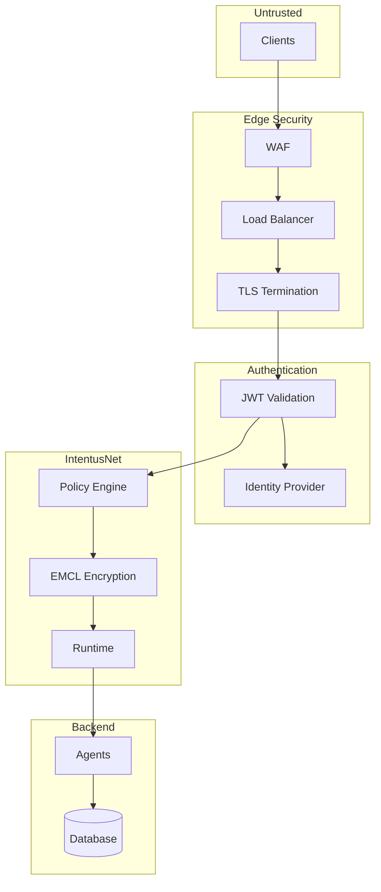

# Production Security

This guide covers security best practices for deploying IntentusNet in production.

## Security Architecture



## TLS Configuration

### Minimum Requirements

- TLS 1.2 or higher
- Strong cipher suites
- Valid certificates from trusted CA
- Regular certificate rotation

### Nginx TLS Example

```nginx
server {
    listen 443 ssl http2;
    server_name intentusnet.example.com;

    ssl_certificate /etc/ssl/certs/intentusnet.crt;
    ssl_certificate_key /etc/ssl/private/intentusnet.key;

    ssl_protocols TLSv1.2 TLSv1.3;
    ssl_ciphers ECDHE-ECDSA-AES128-GCM-SHA256:ECDHE-RSA-AES128-GCM-SHA256;
    ssl_prefer_server_ciphers on;

    ssl_session_cache shared:SSL:10m;
    ssl_session_timeout 1d;

    add_header Strict-Transport-Security "max-age=31536000" always;

    location / {
        proxy_pass http://intentusnet:8080;
        proxy_set_header Host $host;
        proxy_set_header X-Real-IP $remote_addr;
    }
}
```

## Authentication Integration

### JWT Validation Middleware

```python
from jose import jwt
from intentusnet.middleware import RouterMiddleware

class JWTAuthMiddleware(RouterMiddleware):
    def __init__(self, jwks_url: str, audience: str):
        self.jwks_url = jwks_url
        self.audience = audience
        self._jwks = self._fetch_jwks()

    def before_route(self, env):
        token = env.metadata.identityChain[0] if env.metadata.identityChain else None

        if not token or not token.startswith("Bearer "):
            raise UnauthorizedError("Missing or invalid token")

        try:
            payload = jwt.decode(
                token[7:],
                self._jwks,
                algorithms=["RS256"],
                audience=self.audience
            )
            # Add validated identity to context
            env.context.authenticated_user = payload.get("sub")
            env.context.roles = payload.get("roles", [])

        except jwt.JWTError as e:
            raise UnauthorizedError(f"Invalid token: {e}")
```

### Identity Chain Propagation

```python
# Add authenticated identity to chain
env.metadata.identityChain = [
    f"user:{authenticated_user}",
    f"service:api-gateway",
    *env.metadata.identityChain
]
```

## Policy Engine Configuration

### Production Policy Example

```python
from intentusnet.security import PolicyEngine, PolicyRule, PolicyAction

policies = PolicyEngine([
    # Block unauthenticated requests
    PolicyRule(
        id="require-auth",
        action=PolicyAction.DENY,
        intents=["*"],
        agents=["*"],
        roles=[],  # Empty = no roles = unauthenticated
        tenants=["*"]
    ),

    # Protect admin operations
    PolicyRule(
        id="admin-only",
        action=PolicyAction.DENY,
        intents=["Admin*", "Delete*", "Config*"],
        agents=["*"],
        roles=["user", "viewer"],  # Non-admin roles
        tenants=["*"]
    ),

    # Rate limit by tenant
    PolicyRule(
        id="tenant-rate-limit",
        action=PolicyAction.ALLOW,
        intents=["*"],
        agents=["*"],
        roles=["*"],
        tenants=["*"],
        rate_limit_per_minute=1000,
        rate_limit_key_template="{tenant}"
    ),

    # Default allow for authenticated users
    PolicyRule(
        id="default-allow",
        action=PolicyAction.ALLOW,
        intents=["*"],
        agents=["*"],
        roles=["user", "admin"],
        tenants=["*"]
    ),
])
```

## EMCL Encryption

### Key Management

```python
import os
from cryptography.hazmat.primitives import hashes
from cryptography.hazmat.primitives.kdf.pbkdf2 import PBKDF2HMAC
from intentusnet.security import AESGCMEMCLProvider

def get_encryption_key() -> bytes:
    """Get encryption key from secure source."""
    # Option 1: Environment variable (development)
    # key_hex = os.environ.get("INTENTUSNET_ENCRYPTION_KEY")

    # Option 2: HashiCorp Vault (production)
    # client = hvac.Client(url=os.environ["VAULT_ADDR"])
    # secret = client.secrets.kv.read_secret_version(path="intentusnet/encryption")
    # key_hex = secret["data"]["data"]["key"]

    # Option 3: AWS KMS
    # kms = boto3.client("kms")
    # response = kms.decrypt(CiphertextBlob=encrypted_key)
    # key_hex = response["Plaintext"].hex()

    return bytes.fromhex(key_hex)

# Create EMCL provider
emcl = AESGCMEMCLProvider(key=get_encryption_key())
runtime = IntentusRuntime(emcl_provider=emcl)
```

### Key Rotation

```python
def rotate_encryption_key():
    """Rotate EMCL encryption key."""
    # 1. Generate new key
    new_key = os.urandom(32)

    # 2. Create new provider
    new_emcl = AESGCMEMCLProvider(key=new_key)

    # 3. Re-encrypt existing records (if needed)
    # Note: Execution records are typically not re-encrypted
    # as they should be immutable

    # 4. Store new key in vault
    store_key_in_vault(new_key)

    # 5. Update runtime
    runtime.update_emcl_provider(new_emcl)
```

## Input Validation

### Envelope Validation

```python
from pydantic import BaseModel, validator
from typing import Optional, List, Dict, Any

class SecureEnvelope(BaseModel):
    version: str
    intent: dict
    payload: Dict[str, Any]
    context: dict
    metadata: dict
    routing: Optional[dict]

    @validator('payload')
    def validate_payload_size(cls, v):
        size = len(json.dumps(v))
        if size > 1024 * 1024:  # 1MB limit
            raise ValueError("Payload too large")
        return v

    @validator('payload')
    def sanitize_payload(cls, v):
        # Remove potentially dangerous fields
        dangerous_keys = ['__proto__', 'constructor', 'prototype']
        return {k: v for k, v in v.items() if k not in dangerous_keys}
```

## Secrets Management

### Environment Variable Security

```bash
# Never in code or logs
export INTENTUSNET_DB_PASSWORD="..."
export INTENTUSNET_API_KEY="..."

# Use secrets manager in production
export VAULT_ADDR="https://vault.example.com"
export AWS_SECRETS_MANAGER_ENDPOINT="..."
```

### Secrets in Agents

```python
class SecureAgent(BaseAgent):
    def __init__(self, definition, router, secrets_client):
        super().__init__(definition, router)
        self._secrets = secrets_client

    def handle_intent(self, env):
        # Fetch secret at runtime, not stored in memory
        api_key = self._secrets.get("external-api-key")

        # Use secret
        result = call_external_api(api_key, env.payload)

        # Don't log or record secrets
        return AgentResponse.success(
            {"result": result},  # Never include api_key
            agent=self.name
        )
```

## Audit Logging

### Security Events

```python
import logging

security_logger = logging.getLogger("intentusnet.security")

def log_security_event(event_type: str, details: dict):
    security_logger.info(
        f"Security event: {event_type}",
        extra={
            "event_type": event_type,
            "timestamp": datetime.utcnow().isoformat(),
            **details
        }
    )

# Log authentication
log_security_event("auth_success", {"user": user_id, "method": "jwt"})
log_security_event("auth_failure", {"reason": "invalid_token", "ip": client_ip})

# Log policy decisions
log_security_event("policy_deny", {"intent": intent_name, "rule": rule_id})

# Log sensitive operations
log_security_event("admin_action", {"action": "delete_user", "target": user_id})
```

## Network Security

### Firewall Rules

```bash
# Only allow HTTPS from load balancer
iptables -A INPUT -p tcp --dport 8080 -s 10.0.0.0/8 -j ACCEPT
iptables -A INPUT -p tcp --dport 8080 -j DROP

# Allow metrics scraping from Prometheus
iptables -A INPUT -p tcp --dport 9090 -s 10.0.1.0/24 -j ACCEPT
```

### Service Mesh (Istio)

```yaml
apiVersion: security.istio.io/v1beta1
kind: AuthorizationPolicy
metadata:
  name: intentusnet-policy
spec:
  selector:
    matchLabels:
      app: intentusnet
  rules:
    - from:
        - source:
            principals: ["cluster.local/ns/default/sa/api-gateway"]
      to:
        - operation:
            methods: ["POST"]
            paths: ["/api/v1/intent"]
```

## Security Checklist

### Pre-Deployment

- [ ] TLS configured with strong ciphers
- [ ] Authentication integrated
- [ ] Policy engine configured
- [ ] Secrets in secure storage
- [ ] Input validation enabled
- [ ] Audit logging configured

### Ongoing

- [ ] Regular certificate rotation
- [ ] Key rotation schedule
- [ ] Security patches applied
- [ ] Penetration testing
- [ ] Access review
- [ ] Log monitoring

## See Also

- [Security Model](../architecture/security-model) — Architecture details
- [Policy Design](../advanced/policy-design) — Policy configuration
