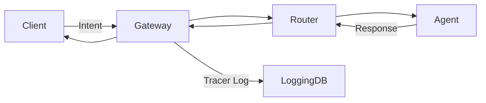

# RFC-0006: IntentusNet Tracer & Observability

## Status
Draft

## Abstract
This RFC defines the **IntentusNet Tracer**, a mandatory observability layer for all intents processed within the network.
The Tracer provides **auditing, debugging, and analytics** capabilities without exposing sensitive payload content.

---

## 1. Purpose

- Capture metadata of **all intent requests and responses**.
- Track **routing decisions**, including priority, fallback, and qualifier relaxations.
- Record **security envelope validation**, including EMCL verification results.
- Enable **debugging, performance monitoring, and auditing** across agents and routers.

---

## 2. Tracer Envelope

For each intent, the Tracer records a structured log:

```json
{
  "intent_id": "string (UUID)",
  "timestamp": "ISO8601 datetime",
  "source": "client or agent id",
  "destination": "agent id or router",
  "routing": {
    "priority": 1,
    "fallback_used": false,
    "qualifiers_relaxed": ["string"]
  },
  "security": {
    "emcl_verified": true,
    "signer": "agent id",
    "hmac_valid": true
  },
  "status": "success | failed | pending",
  "latency_ms": 123
}
```

---

## 3. Logging Principles

1. **Non-Invasive**: Do not expose sensitive payload data; only metadata is logged.
2. **Deterministic Tracking**: Maintain the same `intent_id` across the request and response path.
3. **Fallback & Priority Transparency**: Record the routing decisions clearly for audit and analysis.
4. **Security Awareness**: Log EMCL verification success/failure without logging encryption keys.
5. **Persistence**: Logs may be stored locally, in distributed DBs, or in cloud observability services.

---

## 4. Example Flow



**Tracer captures:**

- `intent_id`, `timestamp`, `source`, `destination`
- `routing.priority`, `routing.fallback_used`, `routing.qualifiers_relaxed`
- `security.emcl_verified`, `security.signer`, `security.hmac_valid`
- `status`, `latency_ms`

---

## 5. Use Cases

- **Debugging routing issues**: Identify why a particular agent was chosen or skipped.
- **Audit compliance**: Track message flow and EMCL verification results for regulatory needs.
- **Performance monitoring**: Measure latency and bottlenecks.
- **Analytics**: Understand agent usage, fallback patterns, and load distribution.

---

## Notes

- The Tracer is **required** for all gateways and routers.
- Optional: Aggregated statistics can be periodically exported for dashboards.
- Implementation may integrate with existing observability tools (e.g., Prometheus, ELK stack).

---

## Copyright
All text, diagrams, and specifications in this RFC are part of the IntentusNet project.
Copyright © 2025 Balachandar Manikandan.
Licensed under the MIT License.
