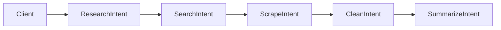

# Advanced Research Demo (IntentusNet v1)

This document walks through the **Advanced Research Demo** included with IntentusNet v1.
The demo demonstrates deterministic routing, fallback behavior, and agent-to-agent coordination
using real execution flow — not mock logic.

The purpose of this demo is to show **how IntentusNet behaves**, not to showcase AI quality.

---

## What This Demo Demonstrates

The advanced research demo illustrates:

- Multi-step intent routing
- Deterministic agent selection
- Explicit fallback between agents
- Agent-to-agent intent emission
- End-to-end synchronous execution

No background jobs, queues, or retries are involved.

---

## High-Level Scenario

The demo implements a simple research workflow:

1. A research topic is provided
2. A search agent retrieves sources
3. A scraper extracts content
4. A cleaner normalizes text
5. A summarizer produces a final result

Each step is handled by a **separate agent**.

---

## Agent Roles

The demo uses the following agents:

- **ResearchOrchestratorAgent**

  - Entry point
  - Coordinates downstream steps

- **SearchAgent**

  - Performs web or data search
  - Has fallback options

- **ScraperAgent**

  - Extracts content from sources

- **CleanerAgent**

  - Normalizes raw content

- **SummarizerAgent**
  - Produces a final summary

Each agent is registered explicitly.

---

## Intent Flow

The intent flow is strictly linear:



Each arrow represents a **new routing cycle**.

---

## Deterministic Routing in Action

At each step:

- The router resolves candidate agents
- Agents are deterministically ordered
- The routing strategy is applied
- Exactly one agent handles the intent

Fallback behavior is predictable and repeatable.

---

## Fallback Example

If the primary search agent fails:

- The router immediately invokes the next candidate
- No retry of the failed agent occurs
- The fallback agent receives the same intent

This behavior is consistent across runs.

---

## Agent-to-Agent Calls

Agents invoke downstream work using:

```python
self.emit_intent("NextIntent", payload)
```

Important characteristics:

- New `IntentEnvelope` is created
- New routing cycle begins
- Execution remains synchronous

There is no shared workflow state.

---

## Error Propagation

If any step fails:

- The error propagates back up the call stack
- The original client receives a single error response
- No partial success is returned

This keeps failure semantics simple.

---

## Tracing Output

The demo produces trace spans showing:

- Final handling agent
- Overall latency
- Success or failure status

Only one trace span is emitted per intent.

---

## Why This Demo Matters

This demo is important because it:

- Exercises real routing paths
- Demonstrates fallback without retries
- Shows how orchestration can be built _on top_ of IntentusNet

It reflects actual v1 behavior.

---

## What This Demo Does Not Show

The demo intentionally avoids:

- Parallel execution
- Async orchestration
- Persistent workflows
- AI quality claims

Those concerns are outside the scope of IntentusNet v1.

---

## Summary

The advanced research demo shows that IntentusNet v1:

- Routes intents deterministically
- Supports explicit fallback
- Enables agent composition
- Remains predictable and debuggable

It is a **behavioral reference**, not a benchmark.
