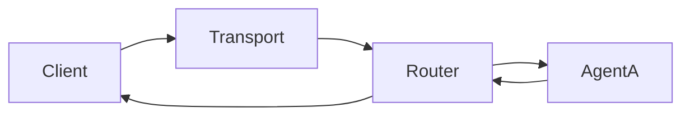
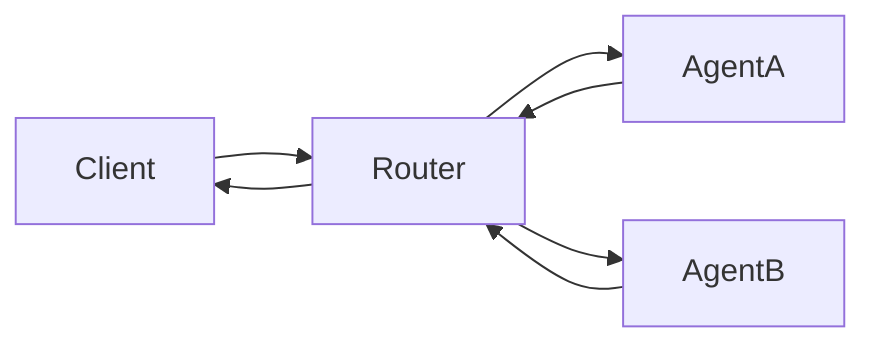

# Deterministic Routing Demo (IntentusNet v1)

This document explains the **Deterministic Routing Demo** provided with IntentusNet v1.
The demo exists to show _exactly_ how routing decisions are made and why the outcome
is predictable across runs.

This is the **canonical demo** for understanding IntentusNet v1 behavior.

---

## Purpose of This Demo

The deterministic routing demo demonstrates:

- Capability-based agent selection
- Deterministic agent ordering
- Explicit routing strategies
- Predictable fallback behavior
- Single-response guarantees

The demo avoids AI complexity and focuses purely on routing mechanics.

---

## Scenario Overview

The demo sends a single intent into the runtime with multiple registered agents
capable of handling it.

Agents are intentionally configured so that:

- Ordering matters
- Fallback behavior can be observed
- The same agent is chosen every time

---

## Registered Agents

The demo registers multiple agents for the same intent.

Each agent:

- Declares the same intent capability
- Has a deterministic position based on definition metadata
- Returns either success or failure intentionally

This setup ensures routing decisions are visible.

---

## Execution Flow

The routing flow for the demo is:

If fallback is enabled, the flow extends deterministically:

---

## Deterministic Ordering in Practice

Before execution:

- The router collects all matching agents
- Agents are sorted deterministically
- The sorted list is fixed for the routing call

This ordering does not change based on:

- Runtime conditions
- Previous failures
- Transport choice

---

## Strategy Demonstration

The demo typically uses one of:

- `DIRECT` – first agent always wins
- `FALLBACK` – agents tried sequentially

By switching the strategy, the demo shows how behavior changes
_without changing agent registration_.

---

## Fallback Walkthrough

When fallback is enabled:

1. First agent is invoked
2. If it fails, the next agent is tried
3. This continues until success or exhaustion

No retries occur.
No parallel execution occurs.

---

## Expected Output

Across repeated runs:

- The same agent is selected
- The same fallback path is followed
- The same trace span is produced

This confirms deterministic behavior.

---

## Tracing Behavior

The demo emits:

- One trace span per routed intent
- The final handling agent
- End-to-end latency

Fallback attempts are **not** individually traced.

---

## What This Demo Proves

This demo proves that IntentusNet v1:

- Is deterministic by design
- Produces repeatable routing outcomes
- Makes fallback behavior explicit

It is a behavioral reference, not a performance test.

---

## What This Demo Does Not Prove

The demo does not demonstrate:

- Load balancing
- Parallel orchestration
- Async execution
- AI quality

Those are intentionally out of scope.

---

## Summary

The deterministic routing demo is the **authoritative reference**
for how IntentusNet v1 routing works.

If you understand this demo, you understand the core of IntentusNet.
