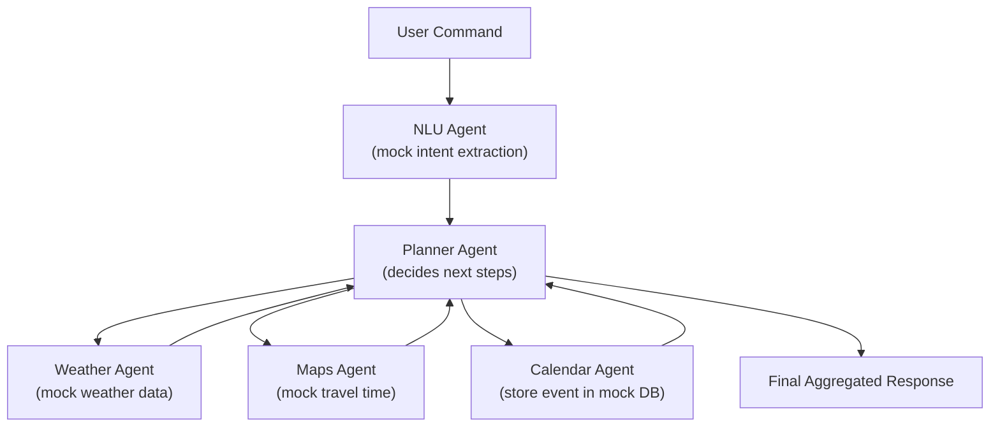
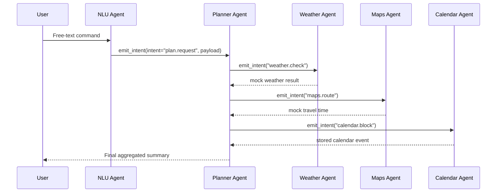

# DLika Demo — Example AI Agent Workflow using IntentusNet

The **DLika Demo** is a compact, self-contained example that demonstrates how **IntentusNet** performs agent registration, intent routing, and simple workflow orchestration using **mock data**.

This example does **not** integrate real APIs or external tools.  
All behaviour (NLU, weather, maps, storage) is simulated for learning and demonstration purposes.

---

## 🎯 Purpose of This Demo

DLika showcases:

- How to define and register agents
- How an intent moves through the IntentusNet runtime
- How agents call one another using `emit_intent()`
- How simple, rule-based workflows can be orchestrated
- How tracing captures agent interaction flow

This makes DLika a clean reference example for understanding multi-agent execution patterns within IntentusNet.

---

# 🧩 Workflow Overview

Below is the complete flow of how a user command is processed:

- User enters natural text
- NLU Agent extracts structured intent (mock logic)
- Planner Agent determines required downstream steps
- Weather, Maps, and Calendar agents return mock results
- Planner aggregates results and returns final response

---

# 🔄 High-Level Flow Diagram (Mermaid)



---

# 📡 Sequence Diagram — Agent-to-Agent Calls



---

# 📁 Directory Structure

```
dlika_demo/
├── __init__.py
├── config.py          # Agent definitions & runtime wiring
├── cli.py             # Demo entrypoint (interactive CLI)
├── storage/
│   ├── calendar_db.py # Local in-memory / JSON-like storage
│   └── contacts_db.py
└── agents/
    ├── nlu_agent.py
    ├── planner_agent.py
    ├── maps_agent.py
    ├── weather_agent.py
    ├── calendar_agent.py
    └── contacts_agent.py
```

---

# 🛠 How the Demo Works

### **1. User Input → NLU Agent (mock parsing)**

The NLU Agent performs deterministic text parsing to extract:

- Action
- Time
- Location
- Checks needed (e.g., weather, route)

It then emits an intent to the Planner Agent.

---

### **2. Planner Agent → Decision Logic**

Based based on the structured intent, the Planner triggers required downstream agents:

- `weather.check`
- `maps.route`
- `calendar.block`

Each downstream call is performed via `emit_intent()`.

---

### **3. Weather, Maps, Calendar Agents (mock behaviour)**

These agents do not call external systems.  
They return simple, deterministic data such as:

```json
{"condition": "Clear"}
{"durationMinutes": 35}
{"status": "Booked"}
```

---

### **4. Final Result**

Planner aggregates all responses and returns a summary to the user via `IntentusClient`.

---

# ▶️ Running the Demo

From the root of the project:

```bash
python -m intentusnet.examples.dlika_demo.cli
```

Example interaction:

```
DLika > Block 8 PM and check if it's good to go to Phoenix Mall
```

---

# 📊 Tracing

All agent interactions are automatically recorded by the built-in trace sink.

You can inspect traces by calling:

```python
runtime.trace_sink.get_spans()
```

This helps understand routing decisions, timing, and execution order.

---

# 🔐 Optional: EMCL Encryption

The demo can be run with EMCL enabled by passing any EMCL provider into `IntentusRuntime`.  
This is optional and off by default.

---

# ✔ Key Takeaways

DLika is intentionally minimal but demonstrates:

- Agent registration & capability mapping
- Intent routing
- Agent-to-agent communication
- Lightweight orchestration behaviour
- Trace visibility and debugging
- Clean project structure for example apps

It is an **educational demonstration**, not a real assistant or production workflow.

---

# 👤 Author

**Balachandar Manikandan**
